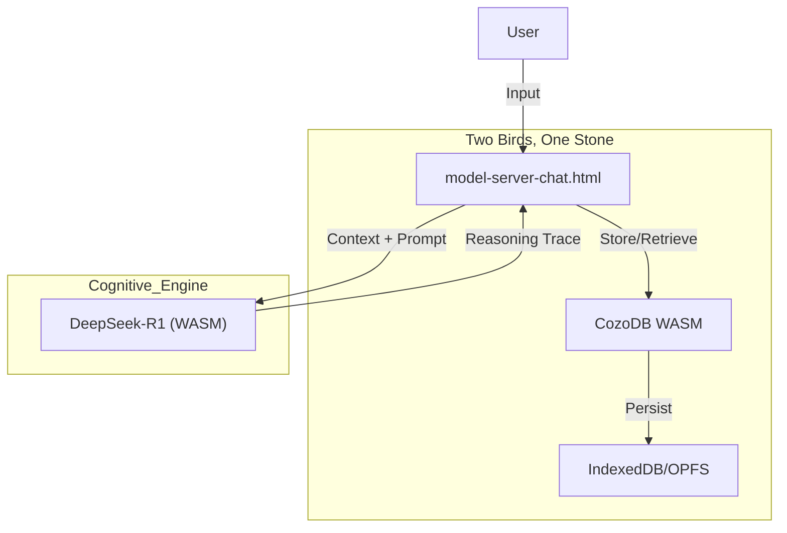

# Context Engine (Sovereign Edition)

> **Philosophy:** Your mind, augmented. Your data, sovereign. Your tools, open.

A **Browser-Native** cognitive extraction system. No servers. No cloud. No installation.
Just you, your browser, and your infinite context.

---

## ⚡ Quick Start

1.  **Download** this repository.
2.  **Open** `tools/index.html` in Chrome or Edge.
3.  **Click** "Double Click to Launch" on the Console.

*That's it. You are running a local LLM with persistent Graph Memory.*

---

## 🏗️ Architecture

The system runs entirely in `tools/` using WebAssembly (WASM).

### 1. The Sovereign Loop

### 2. Core Components
*   **Brain**: `chat.html` - Runs the Graph-R1 Reasoning Loop. Now uses **Hybrid Search** (Vector + BM25 FTS) and supports SOTA models (Qwen 3, Gemma 3).
*   **Memory**: `CozoDB (WASM)` - Stores relations (`*memory`) and vectors. Persists to browser IndexedDB.
*   **Stomach**: `db_builder.html` - Ingests files into the graph. Now "Multisensory-Ready" (Phase A): accepts images/audio as references.

---

## 🔥 Hot Reload System

The system includes a comprehensive hot reload mechanism for GPU management and development:

*   **Automatic Reload**: Changes to GPU-related files trigger automatic reloads
*   **Browser Integration**: Hot reload functionality built into all components
*   **No Service Restart**: Updates occur without restarting services
*   **Stale Lock Prevention**: Automatic cleanup during reloads
*   **Development Mode**: Automatically activates when running on localhost
*   **File Monitoring**: Monitors GPU-related files every 2 seconds for changes
*   **Enhanced Monitoring**: Includes GPU manager with status checking capabilities

### Getting Started with Hot Reload
1. Use the unified startup script: `start-ghost-shell.bat`
2. Monitor changes in real-time with the GPU manager: `python scripts/gpu_manager.py`
3. Manual reload triggers available in browser console: `window.triggerGPUHotReload()`
4. Enable/disable hot reload in browser: `window.setGPUHotReloadEnabled(true/false)`
5. Manual trigger for hot reload: `python scripts/gpu_manager.py --hot-reload`

### Files Monitored
- `tools/webgpu_bridge.py` - Backend bridge logic
- `tools/modules/anchor.js` - Frontend GPU controller
- `tools/model-server-chat.html` - Main console interface
- `tools/anchor-mic.html` - Voice input interface
- `tools/memory-builder.html` - Background processing

### Benefits
- **Faster Development**: Changes take effect immediately
- **No Service Interruption**: Updates occur without restarting services
- **Stale Lock Prevention**: Automatic cleanup during reloads
- **Development Convenience**: Built-in triggers for manual reloads

## 🧠 Text-Only Architecture

The system now focuses purely on text context and memory processing using browser-native WebGPU.

* **Memory Builder (`memory-builder.html`)**: Background processor using Qwen 1.5B in WebGPU
* **CozoDB (WASM)**: Local storage in browser IndexedDB
* **Ghost Engine**: Headless browser handles all processing via WebGPU

## 🎛️ Control Center

* **Context UI (`/context` or `/sidecar`)**: Single, focused interface for retrieval and search in local memory graph. Both endpoints serve the same interface.

## 📊 Logging & Monitoring

The system provides comprehensive logging for debugging and monitoring:

*   **Central Log Viewer**: Access all logs at `http://localhost:8000/log-viewer.html`
*   **File-based Logs**: Individual component logs in the `logs/` directory
*   **Log Truncation**: Automatic truncation to last 1000 lines per file
*   **Real-time Streaming**: Live log updates from all system components

### Log Access
1. **Web Interface**: Visit `http://localhost:8000/log-viewer.html` for real-time logs
2. **File System**: Check individual log files in the `logs/` directory
3. **API Endpoint**: Access recent logs via `/logs/recent` endpoint

## 🖥️ Browser-Based Control Center

The system now features a unified browser-based control center:

*   **Sidecar Interface**: Access the control center at `http://localhost:8000/sidecar`
*   **Dual Tabs**: "Retrieve" tab for context search and "Observe" tab for vision processing
*   **Vision Processing**: Drag-and-drop image processing with Python-powered VLM
*   **Context Retrieval**: Manual context retrieval with one-click copy functionality
*   **System Status**: Real-time system status and log monitoring

## 📱 Low-Resource & Mobile Optimization

The system now supports low-resource devices (phones, small laptops) and CPU-only operation:

*   **Low-Resource Mode**: Set `LOW_RESOURCE_MODE=true` for conservative settings (64MB GPU buffer, single-threaded)
*   **CPU-Only Mode**: Set `CPU_ONLY_MODE=true` to force CPU processing when GPU is unavailable
*   **Mobile Ready**: Optimized for phones and tablets with reduced memory usage
*   **Small Models**: Default to smallest available models (Phi-3.5-mini) for constrained hardware

### Getting Started with Low-Resource Mode
1. Set environment variable: `set LOW_RESOURCE_MODE=true`
2. Start the system: `start-anchor.bat`
3. For CPU-only: `set CPU_ONLY_MODE=true` before starting

## 🏛️ Ghost & Shell Architecture

The system now features the Ghost & Shell architecture for native OS integration:

*   **Ghost Engine**: Headless browser running inference in background (`launch-ghost.ps1`)
*   **Shell Interface**: Native terminal with natural language processing (`anchor.py`, `neural-terminal.html`)
*   **Bridge Protocol**: Secure communication via WebGPU bridge on port 8080
*   **Spawn Endpoint**: Launch native terminals from dashboard (`/v1/system/spawn_shell`)

### Getting Started with Ghost & Shell
1. Start the complete system: `start-ghost-shell.bat`
2. Access the dashboard: `http://localhost:8000`
3. Click "Anchor Shell" to spawn native terminal, or use `python tools/anchor.py`
4. Use natural language commands (prefix with `?` in neural terminal)

### Known Issues
* **Headless GPU Access**: WebGPU may not initialize in some headless environments. Ensure GPU drivers are up to date and hardware acceleration is enabled in browser settings.
* **Model Loading**: Large models may require significant VRAM and take time to load initially.

## 🔄 Model Loading Serialization

The system now includes model loading serialization to prevent GPU overload:

*   **Sequential Loading**: Models load one at a time to prevent GPU resource contention
*   **Queue Management**: Proper queuing of model loading requests
*   **Resource Protection**: Prevents multiple models from loading simultaneously
*   **Improved Stability**: Reduces GPU memory allocation conflicts during startup
*   **Model URL Fixes**: Corrected model URLs to use reliable endpoints

---

## 📚 Documentation

*   **Architecture**: [specs/spec.md](specs/spec.md)
*   **Roadmap**: [specs/plan.md](specs/plan.md)
*   **WASM Layer**: [specs/architecture/sovereign-wasm.spec.md](specs/architecture/sovereign-wasm.spec.md)
*   **Hot Reload System**: Integrated into [WASM Layer Spec](specs/architecture/sovereign-wasm.spec.md)

---

## 🧹 Legacy Support
The old Python/Neo4j backend has been **archived**.
*   Legacy README: [archive/v1_python_backend/README_LEGACY.md](archive/v1_python_backend/README_LEGACY.md)
*   Legacy Code: `archive/v1_python_backend/`