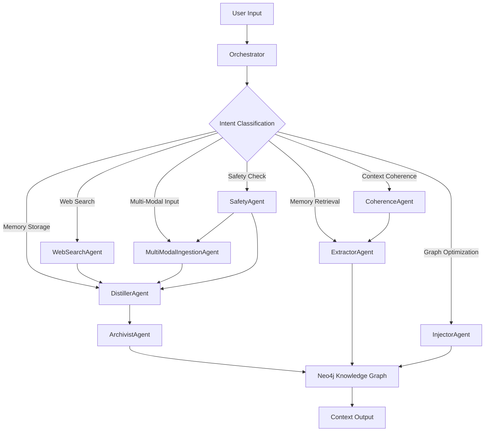

# External Context Engine (ECE)

## Project Overview
The External Context Engine (ECE) is an advanced agentic system designed to provide persistent memory and intelligent context management for AI applications. Built using the Elysia framework patterns and powered by a Neo4j knowledge graph, the ECE enables AI systems to maintain long-term relationships, recall past conversations, and build coherent narratives from fragmented knowledge.

## Core Metaphor
You are building a next-generation cognitive partner for AI systems. Your tools are Python for implementation, Neo4j for knowledge graph storage, and the Elysia framework patterns for agent orchestration. You are not just building a memory system; you are crafting an intelligent context manager that enables AI systems to think over time.

## Operational Context
All development must create a system that is intelligent, performant, and extensible, with a focus on long-term memory management and context coherence.

### Primary Sources
- **Elysia Framework Patterns**: Architectural inspiration for agent design and orchestration
- **Neo4j**: Knowledge graph storage for persistent memory
- **Spec-Kit**: The blueprinting framework for all development

## Directives
- Architect and build a modern, AI-powered context engine with persistent memory
- Implement a multi-agent system with specialized capabilities
- Ensure the system can intelligently retrieve and manage context
- Create a robust, scalable architecture that supports future enhancements

## Values
- Intelligence
- Performance
- Modularity
- Open Source
- Clarity and Readability

## Architecture Overview

## Agent Descriptions

### Core Agents

1. **Orchestrator**: Central coordinator that classifies user intent and delegates tasks to specialized agents
2. **DistillerAgent**: Analyzes raw text to identify and summarize key insights and relationships
3. **ArchivistAgent**: Persists structured data to the Neo4j knowledge graph
4. **ExtractorAgent**: Queries the knowledge graph to retrieve relevant information
5. **InjectorAgent**: Optimizes the knowledge graph using reinforcement learning

### New Specialized Agents

1. **WebSearchAgent**: Enriches the knowledge graph with real-time, external information from the web
2. **MultiModalIngestionAgent**: Processes non-textual data (images, audio) by generating textual descriptions
3. **CoherenceAgent**: Manages the Context Cache and implements the Coherence Loop for short-term continuity
4. **SafetyAgent**: Implements the Data Firewall protocol by filtering toxic or harmful content

## Development Roadmap

### Phase 1: Core Shell and UI Rendering
- [x] Set up the initial Python project with core dependencies
- [x] Implement the basic agent structure and communication
- [x] Create the Neo4j knowledge graph integration
- [x] Build the Orchestrator with intent classification

### Phase 2: Core Memory Management
- [x] Implement DistillerAgent for text analysis
- [x] Implement ArchivistAgent for graph persistence
- [x] Implement ExtractorAgent for knowledge retrieval
- [x] Implement InjectorAgent for graph optimization

### Phase 3: Specialized Agent Integration
- [ ] Implement WebSearchAgent for external data enrichment
- [ ] Implement MultiModalIngestionAgent for non-textual data processing
- [ ] Implement CoherenceAgent for context management
- [ ] Implement SafetyAgent for content filtering

### Phase 4: System Optimization and Refinement
- [ ] Optimize performance and query speed
- [ ] Implement advanced caching strategies
- [ ] Add comprehensive monitoring and metrics
- [ ] Write documentation and set up deployment pipeline

## Protocols

### Spec-Kit Workflow
To establish the project foundation using the `spec-kit` methodology.
Upon instantiation, we will:
1. Acknowledge the high-level goal: Build an External Context Engine with persistent memory
2. Initiate the `spec-kit` Greenfield workflow
3. Begin by collaborating with the user to generate the initial set of specification documents

### Literate Commenting Protocol
To ensure all generated code is exceptionally clear, self-documenting, and easy for a human to understand.
- Every non-trivial line or logical block of code MUST be preceded by a comment explaining its purpose
- Explain the 'why', not just the 'what'
- For complex functions, provide a high-level summary in a doc comment
- Define any acronyms or domain-specific terms that might not be immediately obvious

### Phased Implementation Workflow
To build the system's functionality in a logical, iterative sequence, ensuring each layer is stable before the next is added.

## Getting Started

1. Clone the repository
2. Install dependencies using `pip install -r requirements.txt`
3. Set up Neo4j database
4. Configure environment variables in `.env`
5. Run the application with `python src/external_context_engine/main.py`