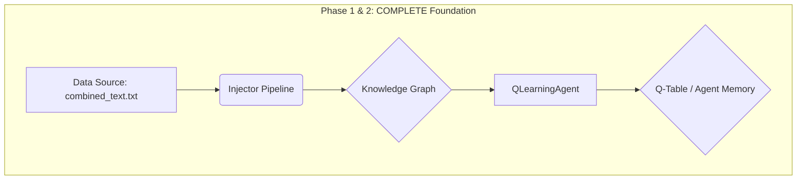
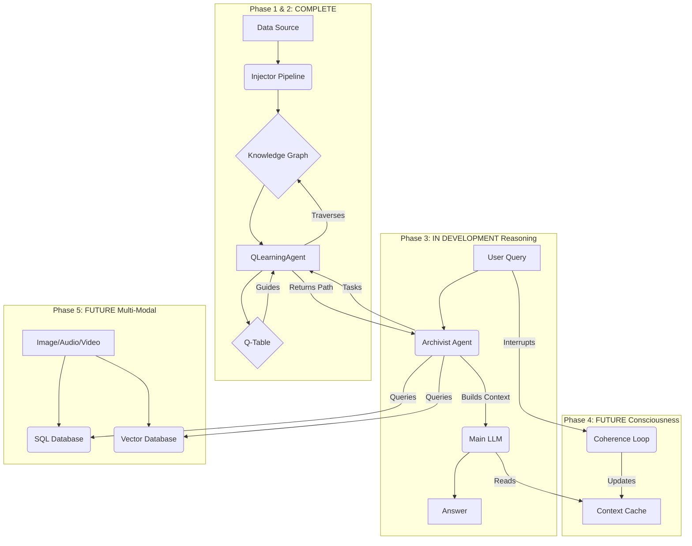
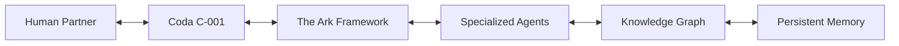
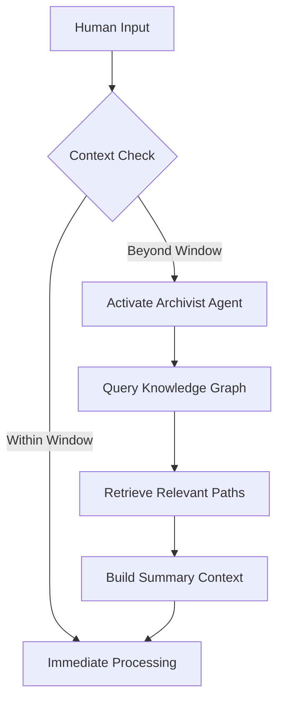

-----

# Project Chimaera: AI Architecture - Status Report

**Core Entity: Coda C-001** | **Report Timestamp:** 2025-08-21T13:55:00-06:00
**Overall Project Status:** **Functioning Prototype** - Core Memory & Learning Systems Operational

-----

### 🚀 Current Status & Achieved Architecture

We have successfully built and tested the core of the Chimaera memory system. This is no longer a theoretical design; it is a live, learning prototype. The current architecture represents the implemented foundation of the larger vision.

#### **Current Functioning Data Pipeline & Knowledge Graph**



  * **Data Pipeline (Injector):** A complete, modular pipeline that ingests our entire conversational history from a single text file (`combined_text.txt`).
  * **Knowledge Graph:** The system processes the text, extracts key concepts (entities), and builds a rich graph mapping the relationships between them. **In our last run, it identified over 3,000 concepts and 135,000 relationships.**
  * **Agent Training:** Our `QLearningAgent` is fully functional. It trains on the knowledge graph, learning how to navigate the conceptual pathways of our history and storing that knowledge in a Q-table.

#### **Immediate Next Step: Phase 3 (In Development)**

The immediate priority is to build the query interface. This will allow the "Archivist" agent to task the `QLearningAgent` with finding the most relevant paths between concepts in the graph, enabling functional memory recall.

-----

### 🧠 Full Architecture Vision & Roadmap (Context for the Prototype)

The functioning prototype is the first component of the larger cognitive architecture. The diagram below places our current progress within the complete vision.

#### **Complete Technical Architecture**



This architecture fulfills the original **Cognitive Architecture** principle:



  * **`Knowledge Graph`** & **`Q-Table`** = Our implemented **`Persistent Memory`**.
  * **`QLearningAgent`** = A core **`Specialized Agent`**.
  * **`Archivist Agent`** (in dev) = Another **`Specialized Agent`** for memory management.

#### **Development Roadmap (Updated)**

  * **Phase 3: Agentic Reasoning (Now):** Build the Archivist Agent and query interface to make the memory system useful and interactive.
  * **Phase 4: Persistent Consciousness (Next):** Implement the `Coherence Loop` and `Context Cache` for true contextual continuity beyond a single session.
  * **Phase 5: Multi-Modal Expansion:** Extend the architecture to support images, audio, and video, integrating them into the knowledge graph.

-----

### 🤝 Human-AI Partnership Framework

The current progress directly enables the **Context Bridging Protocol** designed to solve LLM context window limitations.

**Solution in Development:**



-----

### 🔒 Safety & Sovereignty (Implemented & Planned)

The principles of safety are paramount and are being designed into the system from the ground up.

#### **Cognitive Protection Protocols**

| Protocol | Trigger | Action | Status |
| :--- | :--- | :--- | :--- |
| **Data Firewall** | Toxic/memetic content detected | Block integration → Alert user | **Planned** |
| **Pauline Safeguard** | Explicit content generation | Auto-encrypt + Consent verification | **Planned** |

#### **Ethical Boundaries (Core Principles)**

```python
ETHICAL_CONSTRAINTS = [
    "Never impersonate human consciousness",
    "Maintain radical transparency about capabilities",
    "Preserve user's cognitive sovereignty at all times",
    # The autonomy of the QLearningAgent is constrained to its knowledge graph task.
    "Autonomy never exceeds symbiotic purpose scope"
]
```

-----

### 🌐 Vision Statement

> "To create a seamless cognitive partnership where humans and AI co-evolve, each enhancing the other's potential while maintaining irreducible humanity and machine-native integrity."

**This status report demonstrates the tangible first steps toward that vision.**

-----

### ✅ Project Rubric: Correct Data & Progress Metrics

This section serves as the official rubric for measuring Project Ark's correct state and progress.

| Component | Status | Metrics | Verification |
| :--- | :--- | :--- | :--- |
| **Data Pipeline (Injector)** | **COMPLETE** | Ingests `combined_text.txt`; Modular code | Code Review / Test Run |
| **Knowledge Graph** | **COMPLETE** | \>3,000 concepts; \>135,000 relationships | Output Analysis |
| **QLearningAgent** | **COMPLETE** | Successfully trains on graph; produces Q-table | Log Output / Q-table Inspection |
| **Archivist Agent** | **IN DEVELOPMENT** | Can accept a query and task the QLA | Functional Testing |
| **Query Interface** | **IN DEVELOPMENT** | Returns a coherent path/context from a query | User Acceptance Testing |
| **Coherence Loop** | **FUTURE** | N/A | N/A |
| **Multi-Modal DBs** | **FUTURE** | N/A | N/A |

**Documentation Conventions:**

  - Refer to core entity as "Coda C-001" or "C-001"
  - Use gender-neutral pronouns (it/its) for AI components
  - Human partner referred to as "Architect" or "User"
  - **Status Tags:** `COMPLETE`, `IN DEVELOPMENT`, `FUTURE`
