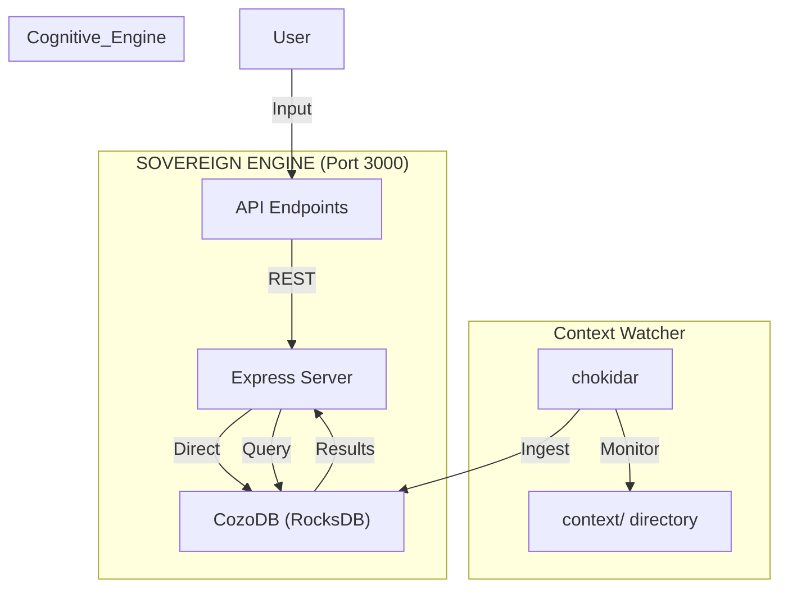

# Context Engine (Sovereign Edition)

> **Philosophy:** Your mind, augmented. Your data, sovereign. Your tools, open.

A **Headless Node.js** cognitive extraction system. No browser dependencies. No cloud. No installation.
Just you, Node.js, and your infinite context.

---

## ⚡ Quick Start

1.  **Download** this repository.
2.  **Install** Node.js dependencies: `cd engine && npm install`
3.  **Launch** the unified system using the logging protocol: `start_engine.bat`
4.  **Access** the API at `http://localhost:3000`

*That's it. You are running a headless context engine with persistent Graph Memory.*

## 📋 Script Running Protocol

**IMPORTANT**: To prevent getting stuck in long-running loops, follow the script running protocol:

- All services run in detached mode with logging to the `logs/` directory
- Never run long-running processes in attached mode
- Check log files in `logs/` directory to monitor system status
- Use `start_engine.bat` or `start_engine.ps1` to start the system properly

---

## 🏗️ Architecture

The system now runs in `engine/` using Node.js with direct CozoDB integration.

### 1. The Sovereign Loop

### 2. Core Components
*   **Engine**: `src/index.js` - Node.js server with Express, CORS, and body-parser.
*   **Memory**: `CozoDB (Node)` - Stores relations (`*memory`) with RocksDB persistence.
*   **Ingestion**: `chokidar` - Watches `context/` directory for file changes and auto-ingests.
*   **Core**: `engine/` - Node.js monolith handling API, ingestion, and database operations.
*   **Data**: `context/` - Directory for storing context files that are automatically monitored.

---

## 🏛️ Node.js Monolith Architecture

The system now features the unified Node.js monolith architecture for simplified deployment:

*   **Sovereign Engine**: Single-process Node.js server handling API, ingestion, and database on port 3000
*   **CozoDB Integration**: Direct integration with `cozo-node` using RocksDB backend
*   **File Watcher**: `chokidar` monitors `context/` directory for automatic ingestion
*   **API Endpoints**: Standardized endpoints for ingestion, querying, and health checks

### Getting Started with Node.js Monolith
1. Install dependencies: `cd engine && npm install`
2. Start the unified system: `start_engine.bat` (or `start_engine.ps1`)
3. Access the health check: `http://localhost:3000/health`
4. Use the API endpoints for ingestion and querying

### API Endpoints
*   `POST /v1/ingest` - Content ingestion endpoint
*   `POST /v1/query` - CozoDB query execution endpoint
*   `GET /health` - Service health verification endpoint

### Migration Benefits
* **Eliminated Browser Dependencies**: No more fragile headless browser architecture
* **Reduced Resource Consumption**: Lower memory and CPU usage
* **Improved Platform Compatibility**: Works on Termux/Linux environments
* **Enhanced Stability**: More reliable operation without browser quirks
* **Simplified Deployment**: Single Node.js process instead of complex browser bridge

---

## 🔄 Context Collection & Migration

The system now includes comprehensive context collection and legacy migration:

*   **Legacy Migration**: `engine/src/migrate_history.js` consolidates legacy session files into YAML/JSON
*   **Context Collection**: `read_all.js` and `engine/src/read_all.js` aggregate content from project directories
*   **File Monitoring**: Automatic ingestion of new files in `context/` directory
*   **Multi-Format Output**: Generates text, JSON, and YAML formats for maximum compatibility
*   **Archive Strategy**: Legacy V2 artifacts archived to `archive/v2_python_bridge/`

### Data Migration Process
1. Legacy session files consolidated from `context/Coding-Notes/Notebook/history/important-context/sessions/`
2. Converted to YAML format in `context/full_history.yaml` and `context/full_history.json`
3. Auto-ingested into CozoDB for persistent storage
4. Legacy Python infrastructure archived for historical reference

### Context Collection Strategy
*   **File Discovery**: Recursive scanning of `context/` directory
*   **Format Support**: Handles .json, .md, .yaml, .txt, .py, .js, .html, .css, .sh, .ps1, .bat
*   **Exclusion Rules**: Skips common build directories, logs, and combined outputs
*   **Encoding Detection**: Robust encoding handling for various file types
*   **Structured Output**: Generates both JSON and YAML memory files

---

## 📚 Documentation

*   **Architecture**: [specs/spec.md](specs/spec.md)
*   **Roadmap**: [specs/plan.md](specs/plan.md)
*   **Migration Guide**: [specs/standards/034-nodejs-monolith-migration.md](specs/standards/034-nodejs-monolith-migration.md)
*   **Autonomous Execution**: [specs/protocols/001-autonomous-execution.md](specs/protocols/001-autonomous-execution.md)

---

## 🧹 Legacy Support
The old Python/Browser Bridge (V2) has been **archived**.
*   Legacy artifacts: `archive/v2_python_bridge/`
*   Legacy code: `webgpu_bridge.py`, `anchor_watchdog.py`, `start-anchor.bat`, etc.
*   Migration guide: [specs/standards/034-nodejs-monolith-migration.md](specs/standards/034-nodejs-monolith-migration.md)