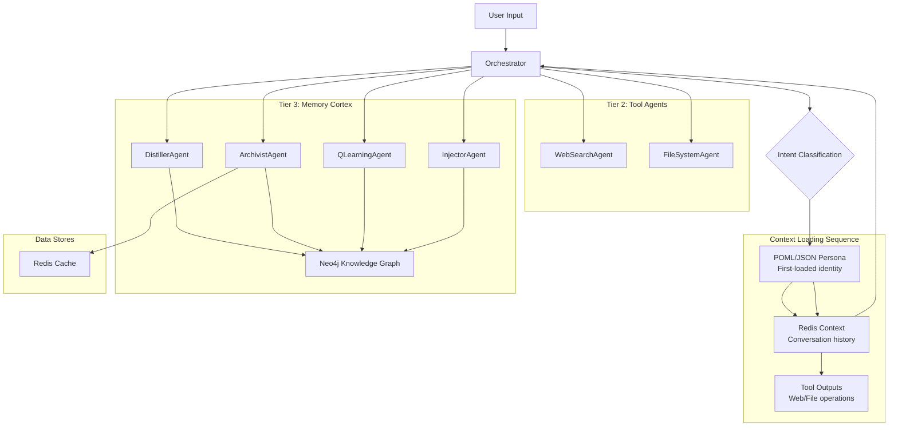

# External Context Engine (ECE) - Project Overview

## Project Description

The External Context Engine (ECE) is a sophisticated cognitive architecture designed to provide persistent memory and context management for AI systems. It's an advanced agentic system that enables AI applications to maintain long-term relationships, recall past conversations, and build coherent narratives from fragmented knowledge. The system is designed to operate entirely on local hardware without cloud dependencies.

## Documentation Policy

The ECE project follows a strict documentation policy to maintain organization and clarity:

### Allowed Markdown Files

Only the following markdown files are permitted to be created or modified in this project:

1. **Root Directory Files**:
   - `@README.md` - Project overview and main documentation
   - `@QWEN.md` - System documentation and specifications

2. **Specs Directory Files** (`@specs//**`):
   - All markdown files in the `specs/` directory are allowed
   - This includes `specs/plan.md`, `specs/reasoning_flow.md`, `specs/spec.md`, `specs/tasks.md`, etc.
   - These files contain detailed technical specifications, development plans, and implementation details

### Documentation Guidelines

- No markdown files should be created outside of the allowed locations
- All project documentation must be integrated into either the root documentation files or the specs directory
- Any new documentation should follow the existing structure and formatting conventions
- Session summaries and development logs should be placed in the `specs/` directory

## 📋 Project Overview

The External Context Engine (ECE) is a sophisticated cognitive architecture designed to provide persistent memory and context management for AI systems. This repository contains the implementation of the ECE, which focuses on creating an intelligent memory management system with Q-Learning powered context retrieval.

## 📝 Documentation Policy

The ECE project follows a strict documentation policy to maintain organization and clarity. Only the following markdown files are permitted to be created or modified in this project:

### Allowed Root Directory Files
- `@README.md` - Project overview and main documentation (this file)
- `@QWEN.md` - System documentation and specifications

### Allowed Specs Directory Files (`@specs//**`)
All markdown files in the `specs/` directory are allowed, including:
- `specs/plan.md` - Development plan and roadmap
- `specs/reasoning_flow.md` - Detailed reasoning flow documentation
- `specs/spec.md` - Technical specifications
- `specs/tasks.md` - Task tracking and progress
- `specs/session_summaries.md` - Session event summaries and logs
- Any other markdown files created in the specs directory for technical documentation

### Documentation Guidelines
- No markdown files should be created outside of the allowed locations
- All project documentation must be integrated into either the root documentation files or the specs directory
- Any new documentation should follow the existing structure and formatting conventions
- Session summaries and development logs should be placed in the `specs/` directory

## 🎯 Key Features

### Intelligent Memory Management
- **Archivist Agent**: Central coordinator for knowledge graph operations
- **QLearning Agent**: Reinforcement learning for optimal path finding
- **Context Cache**: Redis-based caching.
- **Token-Aware Summarization**: Processes large amounts of context.

### Enhanced Context Retrieval
- **Keyword-Based Querying**: Extracts keywords for targeted memory retrieval
- **Semantic Search**: Vector similarity search using Sentence Transformers
- **Path Finding**: Q-Learning optimized traversal of knowledge graph
- **Context Summarization**: Token-aware summarization within LLM limits

### Local-First and Performant
- **Local Execution**: Runs entirely on local hardware without cloud dependencies.
- **Script-based**: Uses simple scripts for launching and managing agents.
- **Memory Management**: Includes a configurable memory limiter for Windows to prevent crashes.
- **GPU Acceleration**: Supports CUDA for accelerated embedding generation.

## Architecture Overview
The ECE implements a multi-tier agent architecture:

- **Tier 1**: Orchestrator Agent - Central coordinator that routes prompts to appropriate agents
- **Tier 2**: Tool Agents - Specialized agents like WebSearchAgent and FileSystemAgent
- **Tier 3**: Memory Cortex - Core memory management agents including:
  - ArchivistAgent: Central coordinator for knowledge graph operations
  - QLearningAgent: Reinforcement learning for optimal path finding in the knowledge graph
  - DistillerAgent: Processes raw text to extract structured information
  - InjectorAgent: Optimizes the knowledge graph through reinforcement learning

### Core Technologies
- **LLM Integration**: Supports multiple providers (Ollama, llama.cpp, Docker Desktop)
- **Knowledge Graph**: Neo4j for persistent memory storage
- **Caching**: Redis-based context cache with 32GB allocation
- **Framework**: FastAPI for web services
- **Communication**: UTCP (Universal Tool Calling Protocol) for tool discovery and execution

## Key Features

### Markovian Thinking Architecture
The ECE implements a sophisticated reasoning system called "Markovian Thinking":
- **Chunked Reasoning**: Processes information in fixed-size context windows
- **Dual-LLM PEVG Model**: Uses a Primary LLM (Generator) and TRM Service (Executor/Verifier)
- **Iterative Refinement**: Implements "propose -> critique -> refine" loops via specialized TRM service
- **Textual Carryover**: Maintains context between chunks with concise summaries

### Implementation Reality
The Markovian thinking is implemented in the `ece/agents/common/markovian_thinker.py` module:
- **MarkovianConfig Class**: Configures the reasoning process with parameters like `thinking_context_size`, `markovian_state_size`, and `iteration_cap`
- **MarkovianThinker Class**: Implements the core algorithm that processes reasoning in fixed-size chunks using textual carryover
- **ReasoningAnalyzer Class**: Determines when to use Markovian thinking based on complexity indicators in the prompt
- The system intelligently routes between Markovian and direct processing based on prompt complexity

### Externalized Memory & Context Management
The ECE implements a multi-tiered context management system that preserves identity and memory external to any model:
- **POML/JSON Persona Loading**: POML/JSON persona files (e.g., orchestrator.json) are loaded FIRST to establish foundational identity, protocols, values, and operational context
- **Redis Context Caching**: Conversation history and contextual information are preserved in a persistent Redis cache
- **Context Summarization**: The ENTIRE Redis cache with conversation context and new content is summarized into new entries
- **Temporal Memory**: Continuous temporal scanning protocol with the Archivist Agent maintains chronological records in Neo4j knowledge graph
- **Tool Integration**: Tool outputs (web search, file read/write, etc.) become part of the accessible context

### Implementation Details
The context loading sequence is implemented through:
- **PersonaLoader**: Loads persona from POML/JSON files first to establish identity
- **ContextSequenceManager**: Manages the complete loading sequence: persona → Redis context → current prompt → tool outputs
- **CacheManager**: Handles Redis-based caching with TTL and semantic search capabilities
- **ArchivistAgent**: Continuously monitors Redis cache and updates Neo4j with temporal context

### Context Loading Order
The following sequence ensures consistent persona and memory across interactions:
1. **POML/JSON Persona**: Loaded first to establish identity and protocols (orchestrator.json)
2. **Redis Context**: Conversation history and contextual information
3. **Current Prompt**: The immediate task or query
4. **Tool Outputs**: Additional information from web search, file operations, etc.

### Multi-Agent Coordination & Emergence
Based on research findings from "Emergent Coordination in Multi-Agent Language Models", the ECE implements enhanced coordination between agents:
- **Thinker Personas**: Each thinker agent is assigned a detailed persona with background, expertise, and personality traits to create stable identity-linked differentiation.
- **Theory of Mind (ToM) Integration**: Thinker agents are instructed to consider what other agents might do and how their actions might affect the group outcome, enabling more effective collaboration.
- **Role Complementarity**: Different thinkers are assigned complementary roles (Optimist, Pessimist, Analytical, Creative, Pragmatic, Strategic, Ethical) to ensure diverse perspectives contribute to the solution.
- **Coordination Analysis**: The system includes metrics to measure synergy, diversity, and complementarity among thinker agents to ensure productive collective intelligence.
- **Emergent Behavior Steering**: Prompt design and role assignments are used to steer the system from mere aggregates to higher-order collectives with coordinated behavior.

### Actual Implementation Notes
While the documentation mentions parallel thinking with specialized thinkers, the current implementation in the EnhancedOrchestratorAgent primarily uses:
- Direct model calls for simpler prompts, managed by the ModelManager for on-demand execution
- Markovian thinking for complex reasoning with chunked processing
- UTCP-based tool usage for external operations
- A simplified approach compared to the original parallel thinking model
- Model lifecycle management through the ModelManager class for resource optimization

### Performance Optimization
- **C++/Cython Integration**: Performance-critical components rewritten in C++
- **Profiling-Driven Development**: Regular performance profiling with cProfile and snakeviz
- **GPU Acceleration**: CUDA support for accelerated embedding generation
- **On-Demand Model Execution**: ModelManager optimizes resource usage by starting models only when needed

### Current State
- Performance-critical components in QLearningAgent and DistillerAgent have been optimized with C++/Cython
- The Markovian Thinking implementation enables linear compute scaling with constant memory usage relative to thinking length
- Asynchronous processing is used throughout to handle concurrent requests efficiently
- Connection pooling and HTTP optimization reduce communication overhead
- Memory management includes configurable limits to prevent crashes on Windows
- The ModelManager provides on-demand model execution to optimize resource usage
- Model lifecycle management automatically starts/stops models to save resources

### Core Capabilities
- **Intelligent Memory Management**: Q-Learning powered context retrieval
- **Context-Aware Prompt Management**: Dynamic adjustment of content based on model capabilities
- **Token-Aware Summarization**: Processes large contexts up to 1M tokens
- **Model-Agnostic Identity**: Persona and memory preserved across different models via external systems
- **On-Demand Model Execution**: Models start when needed for inference and stop to save resources through the ModelManager class
- **Model Selection and Management**: Dynamic switching between different models using the ModelManager
- **Resource Optimization**: Automatic resource management through the ModelManager for efficient hardware utilization
- **Local-First Architecture**: Runs entirely on local hardware without cloud dependencies

## 🏗️ Architecture

The ECE is a multi-agent system composed of smaller, specialized, and independently deployable components.



## Current Architecture Reality

Based on the actual implementation in the codebase, the ECE has evolved from its initial design:

### Orchestrator Implementation
- The orchestrator now implements both Markovian Thinking (for complex reasoning) and direct model response (for simpler queries)
- It uses the EnhancedOrchestratorAgent which handles context-aware prompt management
- UTCP integration is decentralized with direct connections to service endpoints rather than a central registry
- Tool usage is integrated through intent analysis of user prompts
- Model management is handled by the ModelManager class which provides on-demand model execution

### Model Management
- The ModelManager class handles on-demand model execution including starting, stopping, and switching between different models
- Uses a singleton pattern to ensure there is only one global model manager across the entire system
- Supports GGUF model files in the 'models' directory
- Provides automatic port assignment for model servers
- Includes model scanning functionality to detect available models with their properties (size, quantization, etc.)
- Implements shared state mechanism across all ModelManager instances to ensure synchronization between global and orchestrator instances
- Fixes critical synchronization issue where forge-cli model selection was not visible to orchestrator agents
- Correctly handles model paths and API base configuration in config.yaml
- Fixed double `.gguf` extension issue in model paths
- Fixed redundant path structure in model configuration
- Properly manages API base URLs with appropriate port assignments for different models (e.g., port 8091 for gemma model)
- Recently updated to ensure correct communication flow between all components
- Automatically updates configuration when model is changed via forge-cli

### Tool Agent Implementation
- FileSystemAgent and WebSearchAgent are available via UTCP endpoints
- Tool discovery happens dynamically from individual service UTCP endpoints
- Recent fixes ensure proper communication and error handling between orchestrator and tool agents

### Context Loading Implementation
- POML/JSON persona loading is implemented via PersonaLoader
- Context loading follows the correct sequence through ContextSequenceManager
- Redis context caching is implemented via CacheManager
- Tool outputs are integrated after persona and conversation history

### Communication and Logging Updates
- Debug logging has been improved to better track communication between agents
- Fixed communication issues between orchestrator and agent services
- Improved error reporting and logging for better troubleshooting
- Enhanced visibility into system operations for development and debugging
- Debug logs are now properly directed to files in the logs/ directory:
  - `logs/debug_log_ecosystem.txt` - for ecosystem-related logs
  - `logs/debug_log_model_inference.txt` - for model inference logs
  - `logs/debug_log_orchestrator.txt` - for orchestrator logs
- The system uses a rotating file handler to manage log sizes and prevent disk space issues

## Debug Launcher

The ECE includes a debug mode feature that provides enhanced visibility into the ECE agents' operations by displaying all output directly in the terminal, which is invaluable for troubleshooting and development.

### Purpose

The debug mode addresses the need for better visibility during ECE system operation by:
1. Showing all agent output directly in the terminal
2. Providing real-time feedback during system startup and operation
3. Enabling easier debugging of issues with agent initialization or communication
4. Allowing developers to monitor system behavior without external tools

### Implementation

#### PowerShell Script (`utility_scripts\start\start_ecosystem.ps1`)

The PowerShell script provides the core functionality:
- Checks for required Docker services (Neo4j, Redis)
- Detects and manages model servers on various ports
- Starts all ECE agents with visible output in the terminal
- Provides clear status messages and error handling

## Communication and Logging Updates

Recent updates have improved error reporting and logging for better troubleshooting:
- Debug logging has been enhanced to better track communication between agents
- Fixed communication issues between orchestrator and agent services
- Improved error reporting and logging for better troubleshooting
- Enhanced visibility into system operations for development and debugging
- Debug logs are now properly directed to files in the logs/ directory:
  - `logs/debug_log_ecosystem.txt` - for ecosystem-related logs
  - `logs/debug_log_model_inference.txt` - for model inference logs
  - `logs/debug_log_orchestrator.txt` - for orchestrator logs
- The system uses a rotating file handler to manage log sizes and prevent disk space issues
- Fixed communication issues between orchestrator and agent services after recent configuration changes
- Verified that ModelManager automatically updates configuration when model is changed via forge-cli
- Implemented fixes to ensure debug logs are properly directed to files in the logs/ directory as intended
- Improved error reporting to provide clearer visibility into system issues
- Verified proper communication between UTCP endpoints after recent architecture changes
- Tested communication flow between all components to ensure issues are resolved
- Updates configuration for on-demand model management
- Starts ECE agents with visible output in the terminal
- Provides clear status messages and error handling

#### Batch Wrapper (`utility_scripts\start\start_ecosystem.bat`)

The batch file provides a convenient Windows entry point:
- Sets up the correct execution environment
- Calls the PowerShell script with appropriate parameters
- Ensures PowerShell execution policy allows script execution
- Provides user-friendly interface with clear instructions

### Features

#### Service Detection
- Automatically detects Docker installation and running status
- Checks for required Neo4j and Redis containers
- Starts containers if they're not running
- Verifies service readiness before proceeding

#### Model Management
- Updates configuration for on-demand model management via ModelManager
- Models are started and stopped automatically as needed via the ModelManager
- Provides feedback about configuration updates

#### Process Management
- Starts ECE agents processes appropriately
- Waits for proper service initialization before starting agents
- Shows status of running agents

#### Terminal Output
- Displays all ECE agent output directly in the terminal
- Shows startup messages and status updates
- Maintains output visibility for debugging purposes
- Allows Ctrl+C interruption for clean shutdown

### Usage

#### From Command Line
```cmd
utility_scripts\start\start_ecosystem.bat
```

#### From PowerShell
```powershell
utility_scripts\start\start_ecosystem.ps1
```

### Benefits

1. **Enhanced Debugging**: Developers can see exactly what's happening during agent startup and operation
2. **Real-time Feedback**: Immediate visibility into system status and potential issues
3. **No External Tools Required**: Everything is displayed directly in the terminal
4. **Easy Troubleshooting**: Simplifies identification of configuration or connectivity issues
5. **Educational Value**: Helps new developers understand ECE system behavior

### Integration

The debug mode is integrated into the existing ECE utility script structure:
- Located in `utility_scripts/start/ps1/` and `utility_scripts/start/bat/`
- Documented in `utility_scripts/start/README.md`
- Referenced in the main project README.md

### Future Enhancements

Potential future enhancements for the debug mode include:
1. Log file output alongside terminal display
2. Color-coded output for different agent types or message severities
3. Filter options to show/hide specific types of messages
4. Performance metrics display during operation
5. Interactive commands for controlling running agents

### Recent Fixes

Recent fixes that improve debug visibility:
1. UTCP Configuration: The orchestrator now connects directly to individual service UTCP endpoints rather than a centralized registry, making UTCP-related issues easier to identify and debug
2. Neo4j Authentication: Fixed authentication issues by ensuring all agents use consistent credentials, with detailed logging to help diagnose connection problems
3. Service Discovery: Improved service detection and error reporting to help identify when required services (Redis, Neo4j) are not running correctly

## Building and Running

### Prerequisites
- Python 3.11+
- Neo4j database
- Redis server
- CUDA-compatible GPU (for GPU acceleration)

### Setup
1. Install dependencies: `pip install -r requirements.txt`
2. Configure environment: Create `.env` file with Neo4j and Redis connection details
3. Configure LLM provider in `config.yaml`:
   ```yaml
   llm:
     active_provider: llama_cpp  # Can be ollama, docker_desktop, or llama_cpp
     providers:
       llama_cpp:
         model_path: "./models/your-model.gguf"
         api_base: "http://localhost:8080/v1"
   ```

### Running the System

#### Simplified Launcher (Recommended)
The ECE now includes a simplified launcher system that starts only the essential components needed for ECE to run:

1. **Utility Scripts Approach**:
   All launcher scripts have been moved to the `utility_scripts/` directory, organized into focused categories:
   - `utility_scripts/start/` - Scripts for starting the ECE ecosystem (agents + Redis + Neo4j)
   - `utility_scripts/read_all.py` - Script to aggregate all text content into a single corpus

2. **Automatic Model Detection**:
   The start scripts now automatically detect which model server is running and update the ECE configuration accordingly:
   - Scans ports 8080-8094 to find running model servers
   - Updates `config.yaml` with the detected model information
   - Ensures the ECE is always configured to use the currently running model
   - Supports all models in the models/ directory including Gemma-3-4B-IT-QAT-Abliterated.Q8_0 on port 8091

3. **Usage**:
   ```bash
   # Start a model server first
   cd utility_scripts/start
   python run_deepseek_r1_distill_qwen_14b_q4km.py
   
   # In another terminal, start the ECE ecosystem
   cd utility_scripts/start
   python start_ecosystem.py
   ```

#### Packaging (Previously Available)
The ECE previously supported packaging into a single executable, but this approach has been deprecated in favor of simpler script-based deployment.

#### Service Setup

The ECE requires several external services to operate correctly. The simplified launcher automatically handles service setup:

##### Automated Setup (Recommended)

1. Run the simplified launcher:
   ```bash
   cd utility_scripts/start
   python start_ecosystem.py
   ```

2. The launcher will automatically:
   - Check for Docker installation
   - Start required containers (Neo4j, Redis) if not running
   - Detect running llama server instances
   - Update configuration accordingly
   - Start all ECE agents

##### Manual Setup

If you prefer manual setup, follow these steps:

1. **Install Redis**:
   - For Windows: `choco install redis-64 -y` (requires Chocolatey)
   - Or download from https://github.com/tporadowski/redis/releases
   - Start Redis server

2. **Install Neo4j**:
   - Download from https://neo4j.com/download-center/
   - Install Neo4j Desktop or Server
   - Set up a local DBMS with a password (default: 'password')
   - Start the database

3. **Install UTCP components**:
   - Install the UTCP client with: `pip install utcp`
   - Each ECE agent serves its own UTCP manual at the `/utcp` endpoint following the official UTCP 1.0+ specification
   - No central registry is required - services are discovered via their individual endpoints

4. **Verify all services** are running:
   ```bash
   python bootstrap.py
   ```

### UTCP Implementation

The ECE now fully implements the Universal Tool Calling Protocol (UTCP) 1.0+ specification using a decentralized architecture:

- Each service serves its own UTCP Manual at the standard `/utcp` endpoint
- No central registry service is required
- Tools are discovered by fetching UTCP manuals directly from service endpoints
- Each tool is identified with a namespaced identifier (e.g., `filesystem.read_file`)
- The forge-cli can discover and use tools from all running ECE agents
- The orchestrator now connects directly to individual service UTCP endpoints rather than a centralized registry

This decentralized approach provides better reliability, scalability, and aligns with the official UTCP specification.

### Current UTCP Configuration
In the EnhancedOrchestratorAgent, the UTCP configuration is set up with direct endpoints:
- Distiller: http://localhost:8001/utcp
- QLearning: http://localhost:8002/utcp
- Archivist: http://localhost:8003/utcp
- Injector: http://localhost:8004/utcp
- FileSystem: http://localhost:8006/utcp
- WebSearch: http://localhost:8007/utcp

Tools are discovered dynamically when needed rather than cached statically.

### Core Logic and Stability Enhancements
The ECE now includes robust prompt management to prevent context overflow issues:

1. **Context-Aware Prompt Management**: The system includes a context-aware prompt manager that dynamically adjusts content based on model capabilities and context window limits.

2. **Intelligent Truncation**: Uses token counting and content preservation techniques to maintain critical information when prompts are truncated.

3. **Fallback Strategies**: Implements graceful fallback approaches (summarization, chunking) when context limits are reached.

4. **Monitoring**: Comprehensive metrics and monitoring for prompt sizes and context usage across the system.

### EnhancedOrchestratorAgent Implementation
- Implements `process_prompt_with_context_management` method that handles context overflow prevention
- Uses token counting with the `PromptManager` to ensure prompts stay within model limits
- Includes automatic fallback to Markovian thinking or direct model response based on prompt complexity
- Integrates with ArchivistClient for knowledge retrieval while managing context size
- Manages model lifecycle through the `ModelManager` class for on-demand execution

### Model Management Implementation
- **ModelManager Class**: Handles the lifecycle of model servers including starting, stopping, and health checking
- **On-Demand Execution**: Ensures model servers are running when needed and saves resources when idle
- **Model Selection**: Provides functionality to switch between different models dynamically
- **Model Discovery**: Scans the 'models' directory to identify available GGUF models with their properties
- **Resource Optimization**: Automatically manages ports and model resources to prevent conflicts

To run the stability tests:
```bash
python -m pytest Tests/test_prompt_management.py
python -m pytest Tests/test_prompt_management_integration.py
```

(NOTE: Packaging functionality has been removed from the project to simplify the architecture and focus on core functionality.)

### Advanced Model Selection
The system now includes enhanced model selection capabilities:

- **Advanced Model Selection**: Interactive model selection with complete lifecycle management and session context preservation
- **Session Context Preservation**: Preserves conversation context to Redis at session end and loads from Redis at session start
- **Interactive TUI**: Rich terminal interface for model selection with detailed model information
- **On-Demand Model Management**: Integrated with ModelManager for efficient resource utilization

### Utility Scripts Organization

The ECE now includes a comprehensive utility scripts directory with scripts organized into functional subdirectories:

#### Functional Subdirectories

- `utility_scripts/start/` - Scripts for packaging and starting the ECE application
- `utility_scripts/install/` - Scripts for installing packages and modules
- `utility_scripts/testing/` - Scripts for testing and profiling different ECE components

#### Script Types (within each functional directory)

- `bat/` - Windows batch scripts
- `ps1/` - PowerShell scripts
- `sh/` - Shell scripts
- `py/` - Python scripts

#### System Launchers
For ease of use, the ECE provides start scripts in the utility_scripts/start directory:
- `utility_scripts/start/start_ecosystem.bat` - Windows batch script to start ECE services
- `utility_scripts/start/start_ecosystem.ps1` - PowerShell script to start ECE services
- `utility_scripts/start/start_ecosystem.sh` - Shell script to start ECE services
- `utility_scripts/start/start_ecosystem.py` - Python script to start ECE services

These start scripts provide easy access to start the complete ECE system with on-demand model management.

The start scripts provide the following main functions:

##### 1. Complete ECE Start
Starts the entire ECE system with all modules including:
- Required services (Neo4j, Redis)
- All ECE agents (Orchestrator, Distiller, QLearning, Archivist, Injector, FileSystem, WebSearch)
- Configuration for on-demand model management via ModelManager

#### Complete ECE Start Scripts
The `utility_scripts/start/` directory contains complete scripts to start the ECE with all its modules:
- `start_ecosystem.py` - Complete start script for ECE with all modules (Python)
- `start_ecosystem.ps1` - Complete start script for ECE with all modules (PowerShell)
- `start_ecosystem.bat` - Complete start script for ECE with all modules (Windows)
- `start_ecosystem.sh` - Complete start script for ECE with all modules (Linux/macOS)

All start scripts are configured for on-demand model management via the ModelManager, eliminating the need for pre-launched model servers.

#### Configuration Management
- `model_detection_and_config_update.*` - Scripts to automatically update config for on-demand model management

### Quick Start with Launchers

1. Start the ECE ecosystem using one of the scripts in `utility_scripts/start/`
2. The ModelManager will handle model loading on-demand when needed
3. Use the Forge-CLI TUI to select and manage models interactively

### On-Demand Model Management with ModelManager

The ECE now uses the ModelManager for on-demand model execution, which:
- Starts models automatically when needed for processing
- Stops models when not in use to save resources
- Manages model lifecycle efficiently
- Provides interactive model selection via Forge-CLI TUI
4. **Python**: Run `python utility_scripts/start/start_ecosystem.py --skip-model-config`

These start scripts will show all agent output in the terminal, making it easier to troubleshoot issues.

### Important Notes

- Make sure Neo4j and Redis services are running before starting the ECE
- Models need to be placed in the `models/` directory
- The ModelManager handles model lifecycle management automatically, starting models on-demand and stopping them when not in use
- Configuration is automatically managed by the ModelManager

### Troubleshooting

If you encounter issues:
- Check that required services (Neo4j, Redis) are running
- Verify your models are in the correct directory and files aren't corrupted
- Look at the ECE logs for any error messages
- Use the bootstrap check to verify service connectivity

### Markovian Thinking Implementation
The ECE now includes Markovian thinking capabilities for deep reasoning:

1. **TRM Service Client**: The system includes a client for communicating with specialized Tokenized Reasoning Model (TRM) services for iterative refinement.

2. **Markovian Reasoning Loop**: Implementation of the chunked reasoning process with textual carryover between iterations.

3. **Intelligent Routing**: The Orchestrator automatically determines when to use Markovian thinking based on query complexity.

4. **Dual-LLM PEVG Model**: The system leverages both a Primary LLM for final responses and a specialized TRM service for the iterative reasoning process.

To run the Markovian thinking tests:
```bash
python -m pytest Tests/test_markovian_thinking.py
```

### Performance Profiling and Optimization
To profile the ECE application for performance bottlenecks:
```bash
python utility_scripts/profile_ece.py
python utility_scripts/profile_qlearning.py
python utility_scripts/profile_distiller.py
```

To build the optimized C++ extensions with Cython:
```bash
cd utility_scripts/install/py && python setup.py build_ext --inplace
```

Or use the batch script:
```
utility_scripts/build_extensions.bat
```

### Usage
```bash
# Send a context-aware prompt
curl -X POST http://localhost:8000/chat \
  -H "Content-Type: application/json" \
  -d '{"prompt": "What did we discuss about memory management?"}'

# Store new context
curl -X POST http://localhost:8000/memory/store \
  -H "Content-Type: application/json" \
  -d '{"raw_text": "Memory management is crucial for AI systems with large context windows."}'

# Query memory
curl -X POST http://localhost:8000/memory/query \
  -H "Content-Type: application/json" \
  -d '{"query": "memory management", "max_tokens": 1000000}'
```

## 🧠 Core Agents

- **Orchestrator**: The central nervous system. Classifies intent and delegates tasks to other agents.
- **DistillerAgent**: Analyzes raw text to extract entities and relationships.
- **ArchivistAgent**: Persists structured data to the Neo4j knowledge graph.
- **QLearningAgent**: Intelligently traverses the knowledge graph to find optimal context paths.
- **InjectorAgent**: Optimizes the knowledge graph through reinforcement learning.
- **FileSystemAgent**: Provides tools for reading, writing, and listing files.
- **WebSearchAgent**: Provides tools for internet-based searches.

## Development

### Setting Up Development Environment
```bash
# Create virtual environment
python -m venv .venv
# Activate the virtual environment
# On Windows: .venv\Scripts\activate
# On macOS/Linux: source .venv/bin/activate

# Install dependencies
pip install -r requirements.txt
```

### Running Tests
```bash
pytest tests/
```

### Code Quality
```bash
# Project Vision: The Ark

The primary goal of the ECE project is the creation of "The Ark," a sovereign, local-first AI that functions as the Architect's **Externalized Executive Function**. It must be private, efficient, and powerful, operating entirely on local hardware without reliance on cloud services.

## Architectural Philosophy

The ECE architecture represents a deliberate move **away from brittle, monolithic AI systems**. The core philosophy is to build a robust, self-correcting, and intelligent **multi-agent system** composed of smaller, specialized, and independently deployable components.

## LLM Configuration

The ECE supports multiple LLM providers with a flexible configuration system. The configuration is managed through the `config.yaml` file:

```yaml
llm:
  active_provider: ollama  # Can be ollama, docker_desktop, or llama_cpp
  providers:
    ollama:
      model: "granite3.1-moe:3b-instruct-q8_0"
      api_base: "http://localhost:11434/v1"
    docker_desktop:
      model: "ai/mistral:latest"
      api_base: "http://localhost:12434/v1"
    llama_cpp:
      model_path: "/path/to/your/model.gguf"
      api_base: "http://localhost:8080/v1"
```

### Supported Providers

- **Ollama**: Default provider using local Ollama instance
- **Docker Desktop**: OpenAI-compatible endpoint for Docker-based models
- **Llama.cpp**: High-performance local inference with GGUF models

To switch providers, simply change the `active_provider` value in the configuration file.

### Setting up llama.cpp on Windows

To use the llama.cpp provider, build the llama.cpp project on Windows:

1. **Prerequisites**:
   - Git for Windows
   - CMake
   - Visual Studio Community with "Desktop development with C++" workload
   - (Optional) NVIDIA CUDA Toolkit for GPU acceleration

2. **Build Steps**:
   - Clone the repository: `git clone https://github.com/ggerganov/llama.cpp`
   - Create build directory: `mkdir build && cd build`
   - Configure CMake: `cmake .. -G "Visual Studio 17 2022"` (for CPU) or `cmake .. -G "Visual Studio 17 2022" -DLLAMA_CUBLAS=ON` (for CUDA)
   - Build: `cmake --build . --config Release`

3. **Running the Server**:
   - Start with: `server.exe -m path\to\model.gguf -c 4096 --n-gpu-layers -1 --timeout 1800`
   - For optimal performance with quantized models, use -1 for full GPU offloading
   - Update config.yaml to point to the correct model path and server endpoint

4. **Model Selection Considerations**:
   - **Q4_K_M models**: Recommended for optimal performance, offering good speed and accuracy balance with lower VRAM usage
   - **F16 models**: Higher accuracy but slower performance and higher VRAM usage
   - For local development with RTX 4090, Q4_K_M models with full GPU offloading (-1) provide the best performance

5. **Context Configuration**:
   - **General Context**: Configure with --ctx-size to set the overall context window for the model
   - **Per-Request Context**: Use --n-ctx to set the context size per request (important for synthesis tasks)
   - **Synthesis Thinker**: The SynthesisThinker requires special configuration in config.yaml with synthesis_max_tokens to handle combined outputs from multiple thinkers

## Core Technical Strategy

The system is designed to achieve state-of-the-art reasoning capabilities on local hardware by implementing principles from cutting-edge research.

### Cognitive Model: Markovian Thinking

Inspired by the "Markovian Thinker" and "Delethink" research, the ECE's core reasoning process is **not based on an ever-growing context window**. Instead, it operates on a **Markovian principle**, where reasoning is broken down into a sequence of fixed-size "chunks."

-   **Chunked Reasoning:** An agent processes information in a small, fixed-size context window (e.g., 4k or 8k tokens).
-   **Context Reset:** After each chunk is processed, the context is reset.
-   **Textual State (Carryover):** The model is trained to generate a concise **textual summary** of its reasoning at the end of each chunk. This "carryover" is the *only* information passed to the next chunk, acting as the complete state of the reasoning process.

This approach decouples thinking length from context size, enabling **linear compute time and constant memory usage**, which is essential for achieving deep reasoning on local hardware.

### Context Management: Prompt Truncation and Overflow Prevention

To address the critical `context overflow` issue, the ECE implements a robust prompt management system:

-   **Context-Aware Prompt Management**: The system includes a context-aware prompt manager that dynamically adjusts content based on model capabilities and context window limits.
-   **Intelligent Truncation**: Uses token counting and content preservation techniques to maintain critical information when prompts are truncated.
-   **Fallback Strategies**: Implements graceful fallback approaches (summarization, chunking) when context limits are reached.
-   **Monitoring**: Comprehensive metrics and monitoring for prompt sizes and context usage across the system.

### Agentic Framework: The Dual-LLM PEVG Model

Our **Planner, Executor, Verifier, Generator (PEVG)** framework is powered by a dual-LLM strategy that leverages Markovian Thinking:

-   **Primary LLM (The Generator)**: A powerful, general-purpose model (e.g., Phi-3) responsible for generating the final, high-quality, user-facing responses. It operates on a standard, larger context window.
-   **TRM Service (The Markovian Thinker)**: A small, hyper-specialized, and extremely fast model (e.g., a fine-tuned `AI21-Jamba-Reasoning-3B`) that powers the iterative, self-corrective reasoning loop. This is our Executor and Verifier.
-   **EnhancedOrchestratorAgent**: The current implementation uses EnhancedOrchestratorAgent which implements context-aware prompt management, parallel thinking with specialized thinkers, and synthesis of responses. It includes a `process_prompt_with_context_management` method that handles prompt processing with context retrieval from the Archivist, parallel thinking with multiple specialized thinkers, and synthesis of responses.

### Markovian Thinking Architecture

To enable deep reasoning on local hardware, the ECE implements a sophisticated Markovian Thinking architecture based on the research paper "The Markovian Thinker":

-   **TRM Client Integration**: The system includes a TRM_Client class to communicate with specialized Tokenized Reasoning Model services.
-   **Iterative Refinement**: Implements a "propose -> critique -> refine" loop for improving thought processes.
-   **Chunked Reasoning**: Breaks complex problems into fixed-size chunks with textual carryover to maintain context, allowing extremely long reasoning while using bounded memory.
-   **Intelligent Routing**: Determines when to use Markovian thinking based on query complexity and length using the ReasoningAnalyzer.
-   **Carryover Management**: Maintains consistency between reasoning iterations through textual state carryover.
-   **Delethink Environment**: Implements the Delethink RL environment concept where reasoning proceeds in fixed-size chunks, and at each boundary the environment resets the context and reinitializes the prompt with a short carryover from the previous chunk.
-   **Linear Compute Scaling**: Enables linear compute with constant memory usage with respect to thinking length, decoupling "how long the model thinks" from "how much context it must process."
-   **Fallback Mechanisms**: Includes robust fallback to parallel thinking when Markovian reasoning encounters issues.

### Coordination in Multi-Agent Systems

Based on research findings from "Emergent Coordination in Multi-Agent Language Models", the ECE implements enhanced coordination between agents:

-   **Thinker Personas**: Each thinker agent is assigned a detailed persona with background, expertise, and personality traits to create stable identity-linked differentiation.
-   **Theory of Mind (ToM) Integration**: Thinker agents are instructed to consider what other agents might do and how their actions might affect the group outcome, enabling more effective collaboration.
-   **Role Complementarity**: Different thinkers are assigned complementary roles (Optimist, Pessimist, Analytical, Creative, Pragmatic, Strategic, Ethical) to ensure diverse perspectives contribute to the solution.
-   **Coordination Analysis**: The system includes metrics to measure synergy, diversity, and complementarity among thinker agents to ensure productive collective intelligence.
-   **Emergent Behavior Steering**: Prompt design and role assignments are used to steer the system from mere aggregates to higher-order collectives with coordinated behavior.

### Performance Optimization: Python, Cython, and C++

To achieve the required performance, the ECE will adopt a hybrid development model:
-   **Python**: Used for high-level orchestration and non-performance-critical logic.
-   **C++/Cython**: Performance-critical components, identified through profiling with tools like `cProfile` and `snakeviz`, will be rewritten in C++ and bridged to Python using Cython.
-   **Profiling-Driven Development**: Regular performance profiling will be integrated into the development process to continuously identify and address bottlenecks as the system evolves.

## System Components & Deployment

-   **OrchestratorAgent**: The central Planner, delegating tasks via UTCP.
-   **Tool Agents**: `FileSystemAgent`, `WebSearchAgent`.
-   **Memory Cortex**: `Distiller`, `Archivist`, `QLearning`, and `Injector` agents.
-   **Local-First Deployment**: The system is built to run on local scripts, with a future goal of being packaged into a single executable using **PyInstaller**.
-   **Packaging Strategy**: The system will be packaged into a distributable executable with embedded configuration files and a bootstrapping mechanism to check for required services (Neo4j, Redis) before starting agents.

## Validation, Refinement, and Evolution Strategy

With the core architecture complete, the ECE transitions from implementation to validation, refinement, and continuous evolution:

### System Validation & GUI Testing (Phase 6)
The system undergoes rigorous end-to-end testing, focusing on real-world usage scenarios to ensure all components work together seamlessly.

### TRM Specialization (Phase 7)
The mock TRM service will be replaced with fine-tuned specialized models trained on custom datasets for improved reasoning capabilities.

### Continuous Improvement (Phase 8)
The system enters a continuous evolution phase with:
- Active performance monitoring and optimization
- Expansion of specialized TRM models for different tasks
- Continuous curation and expansion of the knowledge graph
- Enhanced self-modification capabilities

## Co-Evolutionary Mandate

The system must be capable of understanding and modifying its own codebase, a goal directly supported by the deep reasoning capabilities enabled by Markovian Thinking.