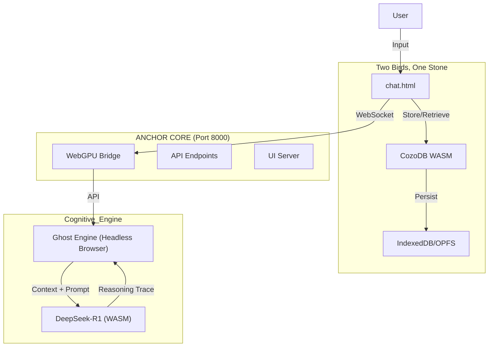

# Context Engine (Sovereign Edition)

> **Philosophy:** Your mind, augmented. Your data, sovereign. Your tools, open.

A **Browser-Native** cognitive extraction system. No servers. No cloud. No installation.
Just you, your browser, and your infinite context.

---

## ⚡ Quick Start

1.  **Download** this repository.
2.  **Launch** the unified system: `start-anchor.bat`
3.  **Open** `http://localhost:8000` in Chrome or Edge.
4.  **Click** "Double Click to Launch" on the Console.

*That's it. You are running a local LLM with persistent Graph Memory.*

---

## 🏗️ Architecture

The system runs entirely in `tools/` using WebAssembly (WASM) with a unified Anchor Core architecture.

### 1. The Anchor Loop

### 2. Core Components
*   **Brain**: `chat.html` - Runs the Graph-R1 Reasoning Loop. Now uses **Hybrid Search** (Vector + BM25 FTS) and supports SOTA models (Qwen 3, Gemma 3).
*   **Memory**: `CozoDB (WASM)` - Stores relations (`*memory`) and vectors. Persists to browser IndexedDB.
*   **Stomach**: `db_builder.html` - Ingests files into the graph. Now "Multisensory-Ready" (Phase A): accepts images/audio as references.
*   **Core**: `webgpu_bridge.py` - Unified server handling API, UI, and WebSocket connections on port 8000.
*   **Ghost**: Headless browser engine providing GPU access for inference.

---

## 🔥 Hot Reload System

The system includes a comprehensive hot reload mechanism for GPU management and development:

*   **Automatic Reload**: Changes to GPU-related files trigger automatic reloads
*   **Browser Integration**: Hot reload functionality built into all components
*   **No Service Restart**: Updates occur without restarting services
*   **Stale Lock Prevention**: Automatic cleanup during reloads
*   **Development Mode**: Automatically activates when running on localhost
*   **File Monitoring**: Monitors GPU-related files every 2 seconds for changes
*   **Enhanced Monitoring**: Includes GPU manager with status checking capabilities

### Getting Started with Hot Reload
1. Use the unified startup script: `start-ghost-shell.bat`
2. Monitor changes in real-time with the GPU manager: `python scripts/gpu_manager.py`
3. Manual reload triggers available in browser console: `window.triggerGPUHotReload()`
4. Enable/disable hot reload in browser: `window.setGPUHotReloadEnabled(true/false)`
5. Manual trigger for hot reload: `python scripts/gpu_manager.py --hot-reload`

### Files Monitored
- `tools/webgpu_bridge.py` - Backend bridge logic
- `tools/modules/anchor.js` - Frontend GPU controller
- `tools/model-server-chat.html` - Main console interface
- `tools/anchor-mic.html` - Voice input interface
- `tools/memory-builder.html` - Background processing

### Benefits
- **Faster Development**: Changes take effect immediately
- **No Service Interruption**: Updates occur without restarting services
- **Stale Lock Prevention**: Automatic cleanup during reloads
- **Development Convenience**: Built-in triggers for manual reloads

## 🏛️ Anchor Core Architecture

The system now features the unified Anchor Core architecture for simplified deployment:

*   **Anchor Core**: Single-process server handling API, UI, and WebSockets on port 8000 (`webgpu_bridge.py`)
*   **Ghost Engine**: Headless browser running inference in background (launched by `start-anchor.bat`)
*   **Shell Interface**: Native terminal with natural language processing (`anchor.py`, `terminal.html`)
*   **Spawn Endpoint**: Launch native terminals from dashboard (`/v1/system/spawn_shell`)

### Getting Started with Anchor Core
1. Start the unified system: `start-anchor.bat`
2. Access the dashboard: `http://localhost:8000`
3. Click "Anchor Shell" to spawn native terminal, or use `python tools/anchor.py`
4. Use natural language commands in the terminal

### Model Loading Strategy (Standard 007)
The system now uses an online-first model loading approach for reliability:
*   **Primary**: Direct HuggingFace URLs for immediate availability
*   **Fallback**: Local model files when available
*   **Bridge Redirect**: `/models/{model}/resolve/main/{file}` handles resolution logic
*   **Simplified Configuration**: Online-only approach prevents loading hangs

### Known Issues
* **Headless GPU Access**: WebGPU may not initialize in some headless environments. Ensure GPU drivers are up to date and hardware acceleration is enabled in browser settings.
* **Model Loading**: Large models may require significant VRAM and take time to load initially.

## 🔄 Model Loading Serialization

The system now includes model loading serialization to prevent GPU overload:

*   **Sequential Loading**: Models load one at a time to prevent GPU resource contention
*   **Queue Management**: Proper queuing of model loading requests
*   **Resource Protection**: Prevents multiple models from loading simultaneously
*   **Improved Stability**: Reduces GPU memory allocation conflicts during startup
*   **Model URL Fixes**: Corrected model URLs to use reliable endpoints

---

## 📚 Documentation

*   **Architecture**: [specs/spec.md](specs/spec.md)
*   **Roadmap**: [specs/plan.md](specs/plan.md)
*   **WASM Layer**: [specs/architecture/sovereign-wasm.spec.md](specs/architecture/sovereign-wasm.spec.md)
*   **Hot Reload System**: Integrated into [WASM Layer Spec](specs/architecture/sovereign-wasm.spec.md)

---

## 🧹 Legacy Support
The old Python/Neo4j backend has been **archived**.
*   Legacy README: [archive/v1_python_backend/README_LEGACY.md](archive/v1_python_backend/README_LEGACY.md)
*   Legacy Code: `archive/v1_python_backend/`