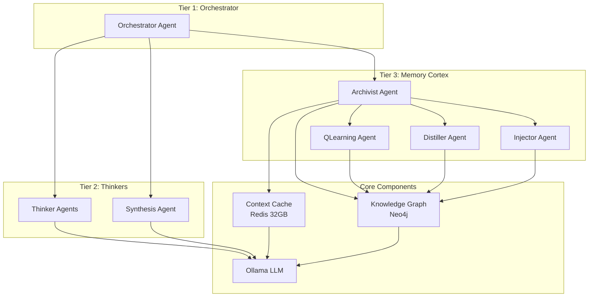

# External Context Engine (ECE) - Memory Management System

## 📋 Project Overview

The External Context Engine (ECE) is a sophisticated cognitive architecture designed to provide persistent memory and context management for AI systems. This repository contains the implementation of Phase 3 of the ECE, which focuses on creating an intelligent memory management system with Q-Learning powered context retrieval.

## 🎯 Key Features

### Intelligent Memory Management
- **Archivist Agent**: Central coordinator for knowledge graph operations
- **QLearning Agent**: Reinforcement learning for optimal path finding
- **Context Cache**: Redis-based caching with 32GB allocation
- **Token-Aware Summarization**: Processes up to 1M tokens of context

### Enhanced Context Retrieval
- **Keyword-Based Querying**: Extracts keywords for targeted memory retrieval
- **Semantic Search**: Vector similarity search using Sentence Transformers
- **Path Finding**: Q-Learning optimized traversal of knowledge graph
- **Context Summarization**: Token-aware summarization within LLM limits

### GPU Acceleration
- **CUDA Support**: Full PyTorch CUDA integration for RTX 4090
- **Batch Processing**: Efficient batch operations for large contexts
- **Mixed Precision**: GPU memory optimization with FP16 support
- **Embedding Generation**: Accelerated embedding computation

### Production Ready
- **Docker Containerization**: Full Docker support with Compose
- **Health Monitoring**: Built-in health checks and metrics
- **Error Handling**: Comprehensive error handling and logging
- **Scalable Architecture**: Designed for high-performance deployment

## 🏗️ Architecture



## 🚀 Quick Start

### Prerequisites
- Docker and Docker Compose
- NVIDIA GPU with CUDA 12.1 support (RTX 4090 recommended)
- 64GB RAM minimum (32GB for cache pool)
- Python 3.11+

### Installation
```bash
# Clone the repository
git clone https://github.com/chimaera-multi-modal-agent/External-Context-Engine-ECE.git
cd External-Context-Engine-ECE

# Configure environment
cp .env.example .env
# Edit .env with your settings

# Start services
docker-compose up -d

# Initialize database
docker-compose exec chimaera-dev python scripts/init_db.py

# Verify health
curl http://localhost:8000/health
```

### Usage
```bash
# Send a context-aware prompt
curl -X POST http://localhost:8000/chat \
  -H "Content-Type: application/json" \
  -d '{"prompt": "What did we discuss about memory management?"}'

# Store new context
curl -X POST http://localhost:8000/memory/store \
  -H "Content-Type: application/json" \
  -d '{"raw_text": "Memory management is crucial for AI systems with large context windows."}'

# Query memory
curl -X POST http://localhost:8000/memory/query \
  -H "Content-Type: application/json" \
  -d '{"query": "memory management", "max_tokens": 1000000}'
```

## 📁 Project Structure

```
External-Context-Engine-ECE/
├── ece/                        # Main ECE source code
│   ├── agents/                 # Agent implementations
│   │   ├── tier1/              # Orchestrator agents
│   │   │   └── orchestrator/   # Main Orchestrator implementation
│   │   ├── tier2/              # Thinker agents
│   │   └── tier3/              # Memory cortex agents
│   │       ├── archivist/      # Archivist agent
│   │       ├── distiller/      # Distiller agent
│   │       ├── injector/       # Injector agent
│   │       └── qlearning/      # QLearning agent
│   ├── components/             # Core components
│   │   └── context_cache/      # Redis-based context cache
│   └── common/                 # Shared utilities
├── specs/                      # Specification documents
│   └── memory-management-system/ # Memory management system specs
├── scripts/                    # Utility scripts
├── tests/                      # Test suite
├── docker-compose.yml          # Docker Compose configuration
├── Dockerfile                  # Docker image definition
├── requirements.txt            # Python dependencies
└── config.yaml                 # System configuration
```

## 🧠 Core Components

### Orchestrator Agent (Tier 1)
The central coordinator that routes prompts to appropriate agents and manages the overall flow.

**Key Features:**
- Intent classification using decision tree
- Agent routing based on prompt analysis
- Context-aware prompt generation
- Parallel thinking workflow management

### Archivist Agent (Tier 3)
The master controller of the memory cortex that manages knowledge graph operations.

**Key Features:**
- Neo4j knowledge graph management
- Context retrieval and storage
- Coordination with QLearning Agent
- Continuous temporal scanning

### QLearning Agent (Tier 3)
Reinforcement learning agent for optimal path finding in the knowledge graph.

**Key Features:**
- Q-Learning for graph traversal optimization
- GPU-accelerated embedding generation
- Token-aware context processing (up to 1M tokens)
- Path ranking and relevance scoring

### Distiller Agent (Tier 3)
Processes raw text to extract structured information for storage.

**Key Features:**
- Named Entity Recognition (NER)
- Relationship extraction
- Text summarization
- Structured data generation

### Injector Agent (Tier 3)
Persists structured data to the Neo4j knowledge graph.

**Key Features:**
- Node and relationship creation
- Data validation and deduplication
- Batch processing support
- Transaction management

### Context Cache (Components)
Redis-based cache for high-performance context storage.

**Key Features:**
- 32GB memory pool allocation
- Token-aware caching strategies
- Semantic search with vector embeddings
- TTL-based expiration management

## 🛠️ Development

### Setting Up Development Environment
```bash
# Create virtual environment
python3.11 -m venv venv
source venv/bin/activate

# Install dependencies
pip install -r requirements.txt

# Install development dependencies
pip install -r requirements_dev.txt

# Run tests
pytest tests/

# Start development server
uvicorn src.external_context_engine.main:app --host 0.0.0.0 --port 8000 --reload
```

### Running Tests
```bash
# Run unit tests
pytest tests/unit/

# Run integration tests
pytest tests/integration/

# Run end-to-end tests
pytest tests/end_to_end/

# Run with coverage
pytest --cov=src tests/
```

### Code Quality
```bash
# Run linting
flake8 src/

# Run type checking
mypy src/

# Format code
black src/
```

## 📊 Performance

### Benchmarks
- **Context Retrieval**: < 2 seconds for graphs under 10K nodes
- **Memory Storage**: < 100ms for single concept insertion
- **Path Finding**: < 500ms with GPU acceleration
- **Context Building**: < 200ms for 4K token summaries
- **Cache Hit Rate**: > 80% with 32GB allocation

### Resource Utilization
- **GPU**: 60-80% utilization during peak (RTX 4090)
- **RAM**: 32GB allocated to cache pool
- **CPU**: 8 cores at 70% utilization (i9-13900HX)
- **Neo4j**: 50 connection pool limit

## 🔧 Configuration

### Environment Variables
```bash
# Neo4j Connection
NEO4J_URI=neo4j://localhost:7687
NEO4J_USER=neo4j
NEO4J_PASSWORD=your_secure_password

# Redis Configuration
REDIS_URL=redis://localhost:6379
REDIS_MAX_CONNECTIONS=100

# Ollama Configuration
OLLAMA_BASE_URL=http://localhost:11434
OLLAMA_MODEL=deepseek-r1:14b-qwen-distill-q4_K_M

# QLearning Configuration
QL_LEARNING_RATE=0.1
QL_DISCOUNT_FACTOR=0.9
QL_EPSILON=0.1

# GPU Configuration
CUDA_DEVICE=0
CUDA_MEMORY_FRACTION=0.8
```

### System Configuration (config.yaml)
```yaml
# LLM Backend Configuration
llm:
  provider: ollama
  config:
    model: "deepseek-r1:14b-qwen-distill-q4_K_M"

# Memory Management Configuration
memory_management:
  cache:
    redis_url: "redis://localhost:6379"
    ttl_seconds: 3600
    max_size_mb: 32768
  q_learning:
    learning_rate: 0.1
    discount_factor: 0.9
    epsilon: 0.1
  gpu:
    device: "cuda:0"
    batch_size: 32
    mixed_precision: true

# Performance Configuration
performance:
  max_concurrent_queries: 100
  query_timeout_seconds: 5
  connection_pool_size: 50
  batch_processing_size: 1000
```

## 📈 Monitoring

### Health Checks
```bash
# Overall system health
curl http://localhost:8000/health

# Archivist health
curl http://localhost:8003/health

# QLearning Agent health
curl http://localhost:8002/health
```

### Metrics
- **Prometheus**: `/metrics` endpoint on all services
- **Cache Stats**: Hit/miss rates and utilization
- **LLM Usage**: Token consumption and latency
- **Graph Ops**: Neo4j query performance
- **GPU Stats**: VRAM usage and utilization

### Logging
- **Structured Logging**: JSON-formatted logs with correlation IDs
- **Log Levels**: Configurable per component
- **Log Aggregation**: Compatible with ELK stack
- **Audit Trail**: Comprehensive operation tracking

## 🔒 Security

### Authentication
- **API Keys**: Strong, rotated API keys for all services
- **Service Accounts**: Dedicated accounts for each component
- **RBAC**: Role-based access control for database operations

### Encryption
- **Data at Rest**: Encrypted storage for sensitive data
- **Data in Transit**: TLS encryption for all communications
- **Secrets Management**: HashiCorp Vault integration

### Network Security
- **Firewall Rules**: Restricted access to service ports
- **Network Segmentation**: Isolated service networks
- **Rate Limiting**: Request throttling to prevent abuse

## 📚 Documentation

### Specification Documents
- `specs/memory-management-system/spec.md` - Core project specification
- `specs/memory-management-system/tasks.md` - Detailed task breakdown
- `specs/memory-management-system/implementation-plan.md` - Technical implementation plan
- `specs/memory-management-system/task_map.yml` - Task-to-code mapping

### Implementation Guides
- `DEPLOYMENT_GUIDE.md` - Complete deployment instructions
- `IMPLEMENTATION_ROADMAP.md` - Development timeline and milestones
- `TASK_LIST.md` - Detailed task list with priorities
- `IMMEDIATE_TASKS.md` - Immediate implementation tasks

### Developer Resources
- `CONTRIBUTING.md` - Contribution guidelines
- `CODE_OF_CONDUCT.md` - Community standards
- `SECURITY.md` - Security policies
- `CHANGELOG.md` - Version history

## 🤝 Contributing

We welcome contributions to the ECE project! Please see our [Contributing Guidelines](CONTRIBUTING.md) for details on how to get involved.

### Code of Conduct
Please note that this project is released with a [Contributor Code of Conduct](CODE_OF_CONDUCT.md). By participating in this project you agree to abide by its terms.

### Reporting Issues
Please use the [GitHub issue tracker](https://github.com/chimaera-multi-modal-agent/External-Context-Engine-ECE/issues) to report bugs or suggest features.

### Submitting Pull Requests
1. Fork the repository
2. Create a new branch for your feature
3. Add your changes
4. Write tests for your changes
5. Update documentation as needed
6. Submit a pull request

## 📄 License

This project is licensed under the MIT License - see the [LICENSE](LICENSE) file for details.

## 🙏 Acknowledgments

- [Chimaera Multi-Modal Agent Project](https://github.com/chimaera-multi-modal-agent)
- [Ollama](https://ollama.ai) for local LLM inference
- [Neo4j](https://neo4j.com) for graph database support
- [Redis](https://redis.io) for caching infrastructure
- [PyTorch](https://pytorch.org) for GPU-accelerated computing

## 📞 Contact

For questions, issues, or collaboration opportunities, please contact the project maintainers:

- **Lead Architect**: [rsbiiw](https://github.com/rsbiiw)
- **Project Coordinator**: [Coda-SpecKit-001](https://github.com/chimaera-multi-modal-agent)

## 🌟 Star History

[](https://star-history.com/#chimaera-multi-modal-agent/External-Context-Engine-ECE&Date)

---
*The External Context Engine (ECE) is transforming how AI systems manage and utilize context, enabling truly persistent and intelligent memory capabilities.*