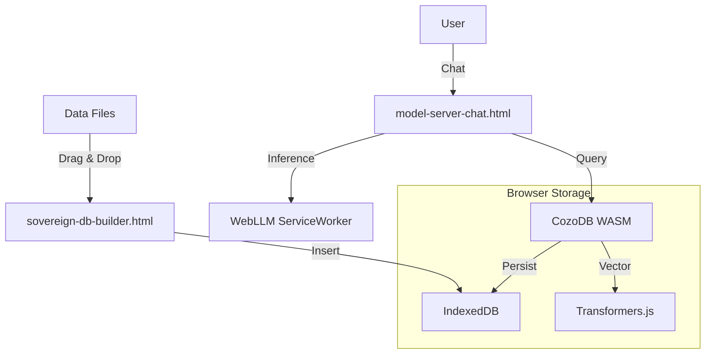

# Architecture Overview: Sovereign Coda (Browser-Native)

**Status:** Production (V2)
**Philosophy:** 100% Local, 100% Browser, 0% Backend.

## Core Stack

The system has migrated from a Python/Neo4j backend to a pure [WASM (WebAssembly)](https://webassembly.org/) stack running directly in the user's browser (Chrome/Edge).

### 1. Compute Layer (WebLLM)
- **Engine:** [WebLLM](https://webllm.mlc.ai/) (MLC-AI)
- **Runtime:** WebGPU (Hardware accelerated)
- **Models:** Quantized (q4f16_1) Llama 3, Qwen 2.5, DeepSeek R1, Gemma 2.
- **Function:** Real-time reasoning, chat inference, logic execution.

### 2. Memory Layer (CozoDB WASM)
- **Database:** [CozoDB](https://cozodb.org/) (Datalog/Relational/Graph)
- **Storage:** IndexedDB / OPFS (Origin Private File System)
- **Structure:**
  - `*memory`: Stored relations (content, timestamp, embedding).
  - `*vectors`: HNSW vector index for semantic search.
- **Query Language:** Datalog (logic-based query).

### 3. Application Layer (HTML5)
- **Format:** Zero-dependency HTML files (no Node.js/Bundler required).
- **Files:**
  - `model-server-chat.html`: The **Brain**. Loads LLM, connects to DB, runs the Reasoning Loop.
  - `sovereign-db-builder.html`: The **Stomach**. Ingests raw files (Markdown/JSON) and creates vector embeddings.
  - `log-viewer.html`: The **Nerves**. Real-time system diagnostics.

## Data Flow

## Critical Workflows

### 1. The Reasoning Loop (Graph-R1)
1. User asks a question.
2. LLM generates a **Datalog Query** (Thinking Process).
3. CozoDB executes the query against local memory.
4. Results are fed back to LLM as Context.
5. LLM synthesizes final answer.

### 2. Context Injection
- **Sovereign-First:** User manually feeds context via the Memory Builder.
- **Privacy:** No data leaves the browser. No API keys sent to cloud.

## Reference Specs
- [Sovereign WASM Spec](architecture/sovereign-wasm.spec.md)
- [Extension Bridge Spec](architecture/extension-bridge.spec.md)
