# Anchor Core Architecture Specification

**Status:** Active | **Component:** `tools/webgpu_bridge.py`

## Overview
The Anchor Core unifies the Bridge, UI, and API into a single process running on port 8000, eliminating CORS issues and port conflicts. The system now uses an online-only model loading approach for reliable operation, with local model resolution as a fallback.

## Architecture Diagram

```mermaid
graph TD
    User["👤 User"] --> Dashboard["🏠 Dashboard (index.html)"]

    subgraph "ANCHOR CORE (Single Process)"
        Bridge["🔗 WebGPU Bridge (8000)"]
        API["⚡ API Endpoints"]
        UI["🌐 UI Server"]
        WS["📡 WebSocket Layer"]
        ModelRedirect["🔄 Model Redirect"]
    end

    Dashboard --> Bridge
    Bridge --> API
    Bridge --> UI
    Bridge --> WS
    Bridge --> ModelRedirect

    subgraph "SHELL PROTOCOL"
        API --> ShellExec["쉘 /v1/shell/exec"]
        API --> Spawn["🚀 /v1/system/spawn_shell"]
    end

    ShellExec --> Host["🖥️ Host System"]
    Spawn --> PowerShell["🪟 PowerShell Window"]

    subgraph "MODEL LOADING"
        ModelRedirect --> Local["💾 Local Models (if available)"]
        ModelRedirect --> Online["🌐 Online Models (fallback)"]
    end
```

## Components

### 1. The Unified Core (`webgpu_bridge.py`)
- **Role:** Single server for API, UI, and WebSockets
- **Port:** 8000 (The One Port)
- **Function:** Bridges browser WebGPU to system commands

### 2. Shell Protocol (The Hands)
- **`/v1/shell/exec`**: Execute system commands via bridge
- **`/v1/system/spawn_shell`**: Spawn native PowerShell terminal

### 3. Dashboard (`index.html`)
- **Role:** Central launch point for all components
- **Features:** Direct spawn of native Anchor shell

### 4. Model Loading System
- **Online-First**: Uses direct HuggingFace URLs for reliable loading (Standard 007)
- **Local Fallback**: Redirects to local models when available, online when not
- **Bridge Redirect**: `/models/{model}/resolve/main/{file}` endpoint handles resolution

## Endpoints

### `POST /v1/chat/completions`
- **Function:** Proxy to browser engine
- **Auth:** Bearer token

### `POST /v1/shell/exec`
- **Function:** Execute system commands
- **Format:** `{ "cmd": "command" }`

### `POST /v1/system/spawn_shell`
- **Function:** Launch native PowerShell client
- **Result:** New `anchor.py` terminal window

## Search Architecture

### Hybrid Retrieval System
* **Vector Search**: Semantic search using cosine similarity (`vec_l2`)
* **BM25 FTS**: Lexical search using CozoDB Full Text Search with stemming
* **Context Manager**: Intelligent retrieval in `ContextManager.findRelevantMemories()`
* **Fallback Mechanism**: Regex-based search when FTS index unavailable

## Security
- **Token Auth:** `Authorization: Bearer sovereign-secret`
- **CORS Policy:** Open for internal use only
- **System Access:** Restricted to authorized commands