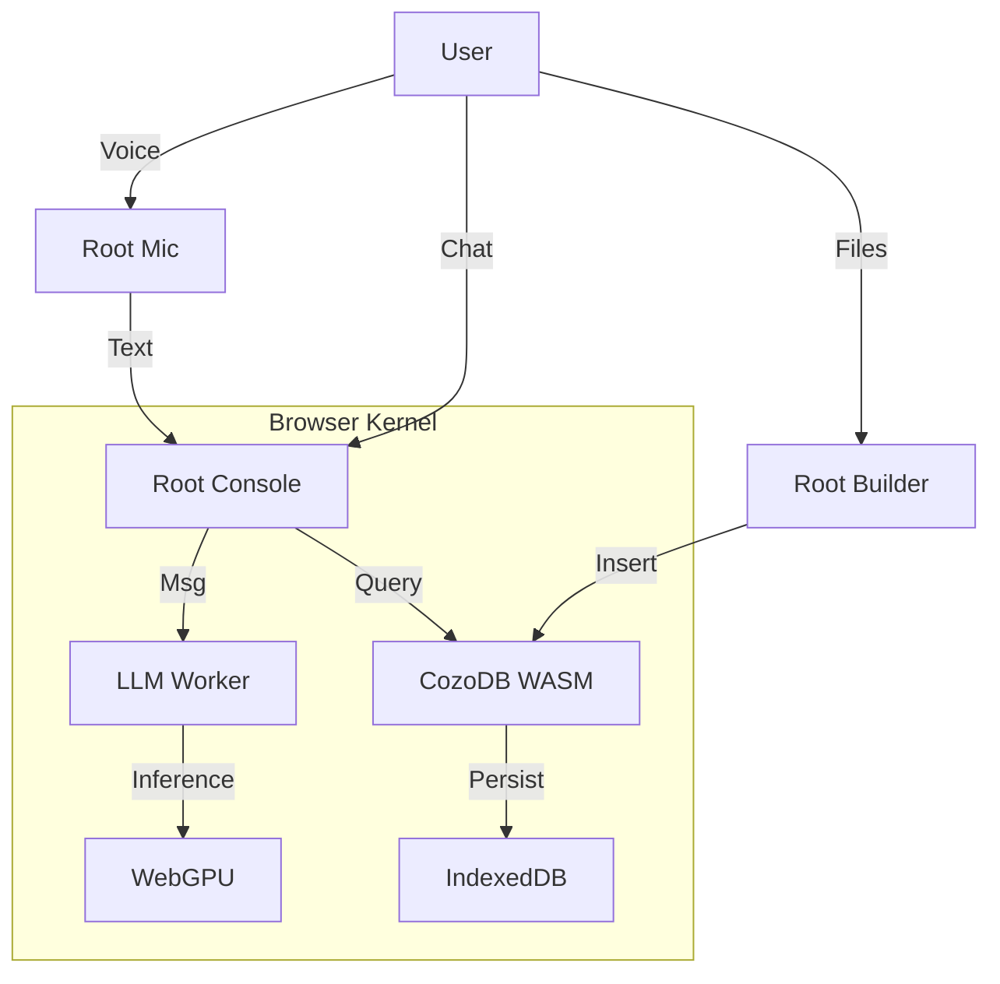

# Architecture Overview: Root Coda (v2.0)

**Status:** Production (Root Architecture)
**Philosophy:** 100% Local, 100% Browser, 100% Sovereign.

## Core Stack

The system has evolved into **Root Coda**, a pure [WASM (WebAssembly)](https://webassembly.org/) ecosystem where the browser is the Operating System.

### 1. The Kernel (`sovereign.js`)
- **Role:** The central nervous system.
- **Function:**
  - **Unified Logging:** Broadcasts to `log-viewer` and Mission Control.
  - **Reactive State:** Zero-dependency `Proxy` store for UI state.
  - **Hardware Abstraction:** "Snapdragon Fix" (WebGPU buffer clamping) and Profile management.
  - **Memory Driver:** Standardized CozoDB WASM initialization.

### 2. The Compute (`web-llm`)
- **Engine:** [WebLLM](https://webllm.mlc.ai/) (MLC-AI)
- **Runtime:** WebGPU (Hardware accelerated)
- **Models:**
  - **SOTA (Latest):** Qwen 3 (4B, 8B) / Gemma 3 (1B) / Phi 3.5
  - **High Performance:** SmolLM2 (1.7B, 360M) / Qwen2.5-3B
  - **Legacy:** Qwen2.5-14B / DeepSeek-R1 (16GB+ VRAM)

### 3. The Memory (`cozo-lib-wasm`)
- **Database:** [CozoDB](https://cozodb.org/) (Datalog/Relational/Graph)
- **Storage:** IndexedDB / OPFS (Origin Private File System) -> Persistent.
- **Schema:**
  - `*memory`: Stored relations (content, timestamp, embedding).
    - **Multisensory (Phase A):** Now includes `mime_type` and `blob_ref` for binary file referencing.
  - `*vectors`: HNSW vector index for semantic search.

### 4. The Interfaces (Root Tools)
- **Root Console** (`model-server-chat.html`): The **Brain**. Runs Graph-R1 in a **Web Worker** (`llm-worker.js`) to prevent UI freezing during inference.
- **Root Builder** (`sovereign-db-builder.html`): The **Stomach**. Ingests files/logs into the Graph.
- **Root Mic** (`root-mic.html`): The **Ears**. Whisper-Tiny (WASM) + LLM cleanup.
- **Log Viewer** (`log-viewer.html`): The **Nerves**. System-wide diagnostics.
- **Root Dreamer** (`tools/root-dreamer.html`): The **Subconscious**. Background optimization and association.

## Data Flow

## Critical Workflows

### 1. The Reasoning Loop (Graph-R1)
1. User input triggers **Hybrid Reflex** (Vector Embedding + Keyword/Regex search in CozoDB).
2. **Context Manager** assembles a "Virtual Prompt" with retrieved clues.
3. LLM executes **R1 Loop**:
   - If answer found: Synthesize.
   - If missing info: Request specific search (`NEED_CONTEXT: term`).
4. Final answer streamed to user.

### 2. The Write Loop (Active Cognition)
- **Concept**: The Brain is no longer read-only.
- **Action**: Every chat interaction is persisted to CozoDB (`*memory` relation).
- **Consolidation**: The "Root Dreamer" (Subconscious) picks up these raw memories, vectorizes them, and creates associations in the background.

### 3. Root Persistence
- **Zero Backend:** Python is only used for serving static files (`http.server`).
- **Portability:** The entire "Brain" is contained in `browser_data` and IndexedDB.

## Reference Specs
- [Sovereign WASM Spec](architecture/sovereign-wasm.spec.md) (Detailed Kernel Docs)
- [Memory Layer Spec](architecture/memory-layer.spec.md)