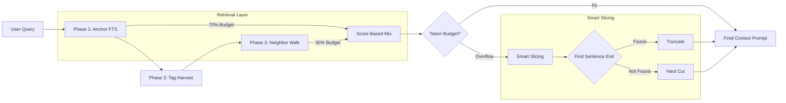

# ECE_Core - Technical Specification

## Mission

Build a **personal external memory system** as an assistive cognitive tool using:
- **CozoDB (RocksDB)**: Unified graph-relational-vector-fts engine (Replacing Neo4j/Redis).
- **Tag-Walker Protocol**: Graph-based associative retrieval (Replacing legacy Vector Search).
- **Mirror 2.0**: Tangible Knowledge Graph filesystem projections.
- **Local-first LLM integration**: `node-llama-cpp` for GGUF support.

**Current**: Node.js Monolith with CozoDB backend.
**Tools**: Loaded via `PluginManager` from `plugins/` directory.

## Architecture Overview

### System Architecture (Tag-Walker)

```mermaid
graph TD
    subgraph "Interface Layer"
        UI[Frontend (React)] -->|API| Server[Express Server]
        Overlay[Desktop Overlay] -->|Loads| UI
        Inbox[Inbox Directory] -.->|File Watch| Watcher[Watchdog Service]
    end

    subgraph "Core Engine (Node.js)"
        Server --> Provider[LLM Provider]
        Watcher --> Refiner[Refiner Service]
        
        subgraph "Ingestion Pipeline"
            Refiner -->|Sanitize| Atomizer[Atomizer]
            Atomizer -->|Zero-Vector Stub| Cozo
        end
        
        subgraph "Inference System"
            Provider -->|Routing| ChatWorker[ChatWorker (Chat Model)]
            Provider -->|Tasks| Orch[OrchestratorWorker]
        end
        
        subgraph "Context Manager"
            Search[Tag-Walker Search] -->|FTS + Pivot| Slicer[Context Slicer]
            Slicer -->|Assembly| Provider
        end
    end

    subgraph "Persistence Layer"
        Cozo[CozoDB (RocksDB)] -->|Mirror 2.0| Mirror[mirrored_brain/ @bucket/#tag]
    end

    style ChatWorker fill:#f9f,stroke:#333
    style Orch fill:#bbf,stroke:#333
    style Cozo fill:#dfd,stroke:#333
```

### Context Assembly Flow (Tag-Walker)



## Graph Architecture: CozoDB

**Verifier Agent** - Truth Verification
- **Role**: Fact-checking via Empirical Distrust
- **Method**: Provenance-aware scoring (primary sources > summaries)
- **Goal**: Reduce hallucinations, increase factual accuracy

**Distiller Agent** - Memory Compression
- **Role**: Memory summarization and compression
- **Method**: LLM-assisted distillation with salience scoring
- **Goal**: Maintain high-value context, prune noise

**Archivist Agent** - Memory Maintenance
- **Role**: Knowledge base maintenance, freshness checks
- **Method**: Scheduled verification, stale node detection
- **Goal**: Keep memory graph current and trustworthy

**Memory Weaver** - Automated Relationship Repair
- **Role**: Automated graph relationship repair and optimization
- **Method**: Tag-based similarity with audit trail (`auto_commit_run_id`)
- **Goal**: Maintain graph integrity without vectors

### Reasoning Architecture: Tag-Walker + CozoDB

**Tag-Walker Reasoning Pattern**:
1. **Anchor** - FTS match for direct entities
2. **Pivot** - Extract tags from anchors
3. **Walk** - Retrieve neighbors via shared tags
4. **Boost** - Apply Sovereign provenance boosting
5. **Synthesize** - Present multi-node context to LLM

**Unified Memory**: Consolidated context management
- **Hot Context**: Active session memories in CozoDB
- **Mirrored Brain**: Filesystem projection via @bucket/#tag structure

### Tool Architecture: UTCP Plugin System

**Current Implementation**: Plugin-based UTCP (Simple Tool Mode)
- Discovery via `plugins/` directory
- Safety layers with whitelist/blacklist
- Human confirmation flows for dangerous operations

**Available Tools**:
- `web_search` - DuckDuckGo with result limits
- `filesystem_read` - File operations with path restrictions
- `shell_execute` - Command execution with safety checks
- `mgrep` - Semantic code search with context

## Infinite Context Pipeline

### Phase 1: Hardware Foundation
- **64k Context Windows**: All LLM servers boot with 65,536 token capacity
- **GPU Optimization**: Full layer offload with Q8 quantized KV cache
- **Flash Attention**: Enabled when available for optimal long-context performance

### Phase 2: Context Rotation Protocol
- **Monitoring**: ContextManager monitors total context length
- **Trigger**: When context approaches 55k tokens (safety buffer for 64k window)
- **Compression**: Distiller compresses old segments into "Narrative Gists"
- **Storage**: Gists stored in Neo4j as `(:ContextGist)` nodes with `[:NEXT_GIST]` relationships
- **Rewriting**: New context = `[System Prompt] + [Historical Gists Summary] + [Recent Context] + [New Input]`

### Phase 3: Graph-R1 Enhancement
- **Historical Retrieval**: GraphReasoner includes `:ContextGist` nodes in retrieval
- **Continuity Maintenance**: Reasoning flow maintained across context rotations
- **Temporal Awareness**: Reasoning considers chronological relationships in gists

## API Specification

### Core Endpoints (Port 8000)

**Chat Interface**:
- `POST /chat/stream` - Streaming conversation with full memory context
- Request: `{"session_id": str, "message": str, "stream": bool}`
- Response: Streaming SSE with full context injection

**Memory Operations**:
- `POST /v1/memory/search` - Tag-Walker search
- `GET /v1/buckets` - List active buckets
- `POST /v1/ingest` - Manual atom ingestion
- `GET /v1/backup` - Snapshot RocksDB state

**Health & Info**:
- `GET /health` - Server health check
- `GET /v1/models` - Available models
- `GET /health/memory` - Memory system status

**MCP Integration** (when enabled):
- `GET /mcp/tools` - Available memory tools
- `POST /mcp/call` - Execute memory tools

## Configuration

### Required Parameters (in `.env` or sovereign.yaml)
- `MODELS_DIR` - Path to GGUF model storage
- `NOTEBOOK_DIR` - Root of the target brain for mirroring
- `LLM_GPU_LAYERS` - GPU offload settings
- `PORT` - Engine API port (default: 3000)

### Optional Parameters
- `ECE_REQUIRE_AUTH` - Enable API token authentication (default: false)
- `ECE_API_KEY` - Static API key when auth enabled
- `MCP_ENABLED` - Enable Model Context Protocol integration (default: true)
- `VERIFIER_AGENT_ENABLED` - Enable truth-checking agent (default: true)
- `ARCHIVIST_AGENT_ENABLED` - Enable memory maintenance agent (default: true)
- `DISTILLER_AGENT_ENABLED` - Enable summarization agent (default: true)

## Security

### Authentication
- Optional API token authentication (controlled by `ECE_REQUIRE_AUTH`)
- Session isolation with UUID-based session IDs
- Memory access limited to owner's session

### Authorization
- Path restrictions on filesystem operations
- Command whitelisting for shell execution
- Rate limiting on all endpoints
- Input validation on all parameters

### Data Protection
- All data stored locally by default
- End-to-end encryption for sensitive memories (optional)
- Audit logging for all memory operations
- Traceability for automated repairs and context rotations

## Performance Optimization

### Hardware Recommendations
- **Minimum**: 16GB RAM, CUDA-capable GPU (RTX series)
- **Recommended**: 32GB+ RAM, RTX 4090 or similar
- **Context Windows**: 64k requires ~8GB VRAM for KV cache with 7B-14B models

### Memory Management
- **Hot Cache**: rocksdb backed CozoDB for all active session and entity memories.
- **Mirrored Brain**: File-based projection in `@bucket/#tag` format for human audit.
- **Cleanup Strategy**: Periodic vacuuming of FTS indices in CozoDB.
- **Caching Strategy**: RocksDB block cache handles L1 performance; Mirror 2.0 provides L2 observability.

## Integration Points

### With Anchor CLI
- HTTP API communication on configured port (default: 8000)
- Streaming responses via Server-Sent Events
- Memory operations through dedicated endpoints

### With Browser Extension
- HTTP API communication for context injection and memory saving
- Streaming chat interface via Side Panel
- Page content reading and memory ingestion

### With LLM Servers
- OpenAI-compatible API for LLM communication
- Streaming response handling via SSE
- Context window management with rotation protocol